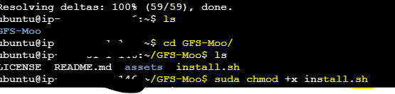
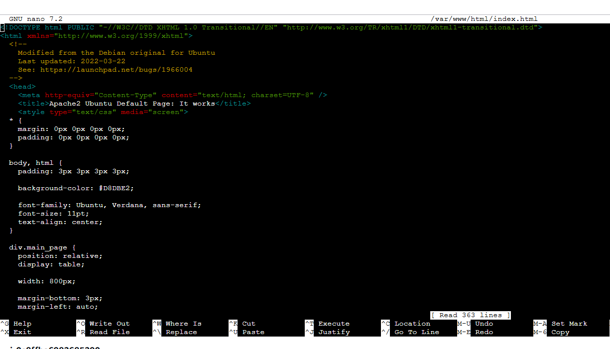

### <u>**D3 18.12.24 5:30pm-7:30pm**</u>
**Review GitHub Best Practices**
* How to review Pull Request and validated changes.
* Importance of not exposing private or sensitive information such as SSH keys, emails, and public keys in repositories.

***

**AWS ECS basic and SSH access**
* **Deploying Virtual Machines (EC2 Instances):**
Launched a virtual machine (VM) using the AWS Console and configured an Ubuntu instance.
&nbsp;
* **SSH Access:**
Learned two ways to connect to EC2 with browser-based connection and using SSH Client (via terminal or Git Bash with .pem key).
&nbsp;
*  **Security Groups:**
Allowed HTTP (port 80), HTTPS (port 443), and SSH (port 22).
&nbsp;
* **Setting up LAMP Server on EC2:**
  Installed a LAMP stack (Linux, Apache, MySQL, PHP) on Ubuntu VM and connected GitHub repository to the server for deployment.
Key Commands:
  * sudo apt-get update
  * Install Git and LAMP components.
  * Use a script to automate LAMP setup.
&nbsp;
* **Website Deployment:**
Deployed a sample website using Git and Apache server and understood the importance of Git in managing deployments.
&nbsp;
#### Brief explaination of below:
**1. EC2:**
  EC2 is Amazon Elastic Compute Cloud (EC2) is a service by Amazon Web Services (AWS) that use to run virtual computers (called instances in the AWS) in the cloud. These instances use to to host websites, applications, or anything else as a regular computer but this is in cloud. Normally it only pay for the time use.
  &nbsp;
**2. LAMP SERVER:**
A LAMP server is a setup for hosting websites. It stands for:

Linux: The operating system.
Apache: The software that serves web pages to users.
MySQL: A database to store information
PHP: A language to create dynamic websites like login systems
All four work together to run websites.

**3.GIT:**
Git is a tool that helps to manage code changes. It tracks the work with save your progress, work with others without overwriting each other's changes,
Undo mistakes and also use "push" to make changes to a remote storage like GitHub and "pull" updates from others to the local computer.
***
### Details Steps:
#### Step 1 : Create and Launch an EC2 Instance
* Go to the AWS Management Console.
* Navigate to EC2 → Click Launch Instance.
* Configure the Instance:
* Name: Provide a name (e.g., MyWebServer).
* AMI: Choose Ubuntu Server 20.04 LTS.
* Instance Type: Select t2.micro (Free Tier eligible).
* Key Pair: Use an existing key pair or create a new one (e.g., webserver masterclass.pem).
* Security Group:
SSH (Port 22) → Source: My IP (for secure SSH access).
HTTP (Port 80) → Source: 0.0.0.0/0 (for public web access).
* Click Launch.

&nbsp;

#### Step 2 :Connect to the EC2 Instance
* Go to the AWS EC2 Console.
* Select the EC2 instance and click Connect.
* Use EC2 Instance Connect to log into the server.

&nbsp;

#### Step 3: Install Git and Set Up the Script
* Update the System: **`sudo apt-get update`**

* Install Git : **`sudo apt install git-all -y`**

* Clone the Script Repository:
**`git clone https://github.com/anuvindhs/GFS-Moo`**

* Navigate to the Project Directory:
 **`ls`**
**`cd GFS-Moo/`**
**`ls`**
* Set Script Permissions: **`sudo chmod +x install.sh`**

* Run the Installation Script : **`./install.sh`** .When prompted, type 1 to install the LAMP server.

* Restart Apache: **`sudo service apache2 restart`**
&nbsp;

#### Step 4: SSH into the Instance Using Git Bash
* Prepare the SSH Key: On the local machine, navigate to the folder where the key file (webserver masterclass.pem) is located. Shift + Right Click → Select "Git Bash Here".
* Set Key File Permissions:**`chmod 400 "webserver masterclass.pem" `** ( from EC2 > connect to instance > SSH client )
* SSH into the Instance:
Copy the Public DNS of your instance from the EC2 console.**`ssh -i "webserver masterclass.pem" ubuntu@<Public_DNS>`**
* When prompted, type yes to confirm the connection.

&nbsp;

#### Step 5: Edit the Web Page
* Open the default Apache web root directory:
**`sudo nano /var/www/html/index.html`**
* Useful command :
  **`Ctrl + O `** --> to save and press enter
**`Ctrl + X `** --> Exit
*Restart Apache to ensure changes take effect:
**`sudo systemctl restart apache2`**

&nbsp;

#### Step 6: Update Own Code website
* Navigate to the target directory:
**`sudo nano /var/www/html/`**
* Clone the repository: Run the following command to clone the GitHub repository:
**`git clone https://github.com/anuvindhs/CLOUD-is-AWSome.git`**
* Verify the contents: After cloning, list the contents to ensure the repository was cloned successfully:
**`ls`**

&nbsp;

#### Step 7: Verify in the Browser
*Open the browser and enter the Public IP Address of  EC2 instance:
**`http://<Your_Public_IP>`**

