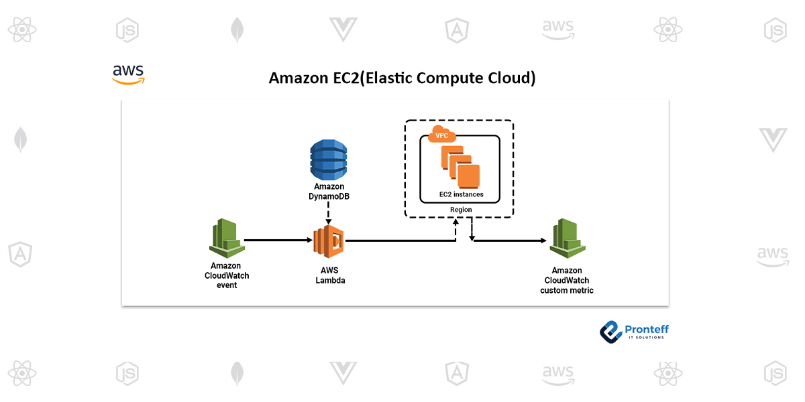
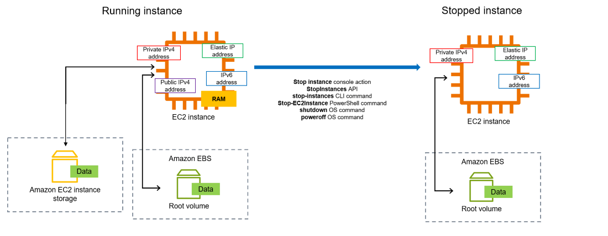
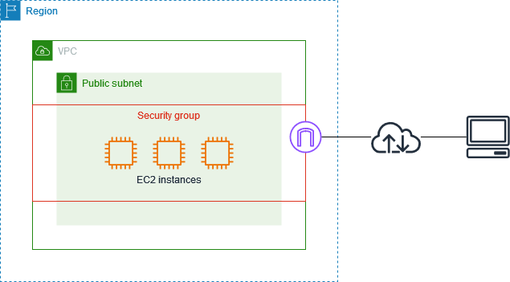
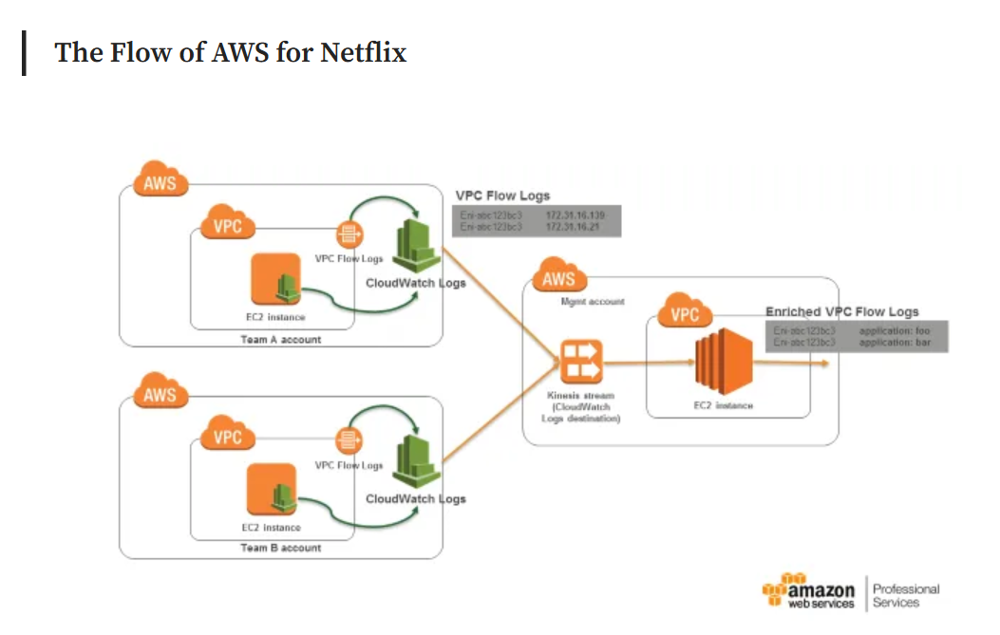

### 01. EC2 (Elastic Compute Cloud)
* **Title:** Computer in Cloud
&nbsp;
* **Introduction:**
EC 2 is a cloud-based service provided by Amazon that allows virtual computers to run programs, websites, or store data. This model can help business to save cost on purchase or maintain the expensive physical computur.

&nbsp;
* **What is EC2?**
EC2 provides virtual machines (called instances) that like normal physical computer but it can easily adjust based on the demand.

&nbsp;
* **Key Features:**
1. Operate the virtual computers at anytime and anywhere.
2. Automatically adjust resources based on demand.
3. Can use Elastic Load Balancing (ELB) to distributes traffic across multiple servers.
4. Use Custom AMIs (Amazon Machine Image) that use ready-made machine setups or create your own as needed.

* **How It Works:**
Login to AWS account --> select a virtual machine -->  customise it based on requirements.
Then launches the machine in the cloud and running.

&nbsp;
* **Benefits:**
Cost effective and scalable (easy adjust)
&nbsp;
* **Use Cases:**
  * Hosting websites or running online application
  * Testing software in a secure environment.
&nbsp;
* **Integration:**
  * VPC (Virtual Private Cloud) for private networks
  * CloudWatch for monitoring
  * IAM (Identity and Access Management) for managing permissions
  * ELB (Elastic Load Balancer)to balance traffic
&nbsp;
* **Getting Started:**
Log in to the AWS Management Console, then go to EC2, choose an instance type, then configure it based on requirement, and launch it.
&nbsp;
* **Best Practices:**
Secure the instances with security group rules and also use Auto Scaling to optimise costs during busy and quiet times.

&nbsp;
* **Challenges and Solutions:**
Cost could be high if resource not use properly, therefore use monitoring tools like CloudWatch to track the usage.
&nbsp;
* **Pricing Overview:**
There are few different price option, such as On-Demand (pay per hour), Spot Instances (cheaper but less predictable), and Reserved Instances (prepaid for discounts). Free Tier allows beginners to use a small instance for free.
&nbsp;
* **Case Studies:**
Netflix uses EC2 to stream videos globally and manage high traffic. EC2 helps them scale resources to meet demand.

&nbsp;
* **Conclusion:**
EC2 is a strong and powerful cloud tool that gives businesses flexibility and control. It is ideal for running applications without the hassle of maintaining physical hardware that what nowadays business needed.
***