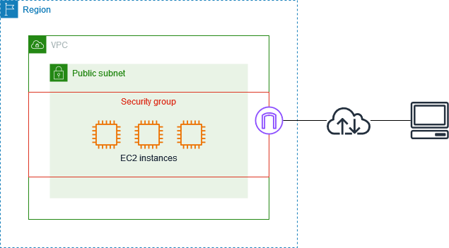
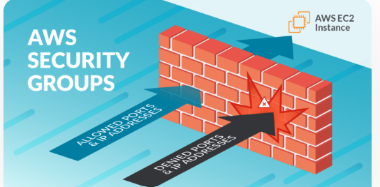
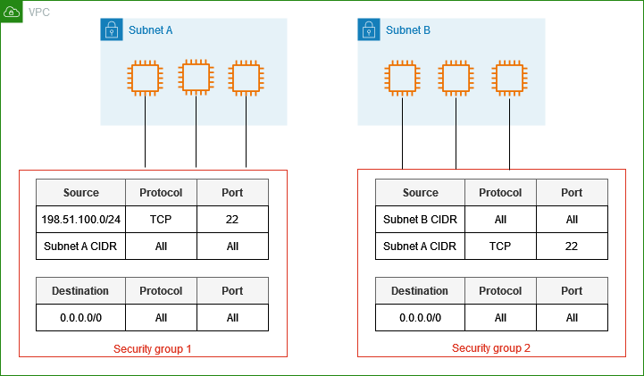

### 02. Security groups and Elastic IP address

* **Title:** Security Group and Elastic IP Address in AWS
&nbsp;
* **Introduction:**
There are tools in AWS that ensure the cloud resources are secure and accessible. They help control who can access the resources and provide a consistent way to connect to them.
&nbsp;
* **What is Security groups and Elastic IP address ?**
Security Groups act like firewalls, allowing or blocking network traffic to AWS resources.
Elastic IPs are fixed IP addresses that stay the same even if the resources restart, making them reliable for public-facing applications.

&nbsp;
* **Key Features:**
1. Access Control to manage inbound and outbound traffic.
2. User can define which IPs and ports are allowed.
3. Elastic IPs give resource a permanent IP.
4. Elastic IPs can move between resources if needed.
   
&nbsp;
* **How It Works:**
Create or attach a security group to an EC2 instance and define rules for what traffic is allowed. For Elastic IP, it allocate an IP address, associate it with the EC2 instance, and use it to connect from the internet.

&nbsp;
* **Benefits:**
It help on improved security and reliability for consistent connectivity.
&nbsp;
* **Use Cases:**
Restrict access to EC2 instances on only selected office or network and assign a static Elastic IP to a public-facing web server.
&nbsp;

* **Integration:**
* EC2 and VPC to secure EC2 instances and ensure proper connectivity in the private network.
&nbsp;
* **Getting Started:**
Create a Security Group in the AWS Console, and add rules for allowed traffic (80 for HTTP and 443 for HTTPS). Besides,allocate an Elastic IP and associate it with running EC2 instance.

&nbsp;
* **Best Practices:**
Use least privilege principles in Security Groups to allow only necessary traffic. Then monitor Elastic IP usage to avoid unnecessary costs.
&nbsp;
* **Challenges and Solutions:**
Misconfigured Security Group rules can leave the resources exposed, therefore it is needed to regularly audit and review security group settings.
&nbsp;
* **Pricing Overview:**
Both are free to use.
&nbsp;
* **Case Studies:**
A financial company uses Security Groups to block unauthorised access and Elastic IPs to ensure users can always reach their web application.
&nbsp;
* **Conclusion:**
Security Groups and Elastic IPs are important for controlling access and ensuring reliable connections to the AWS resources. They keep the applications safe while maintaining availability.
***