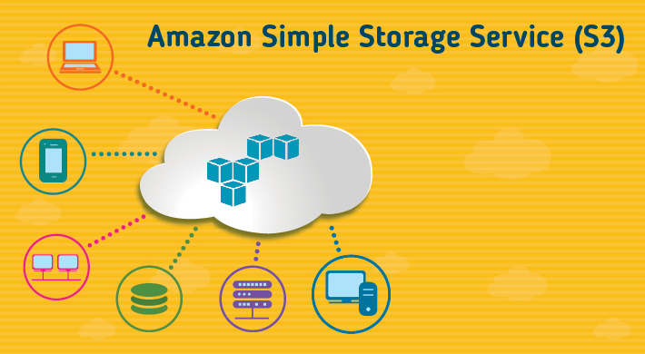
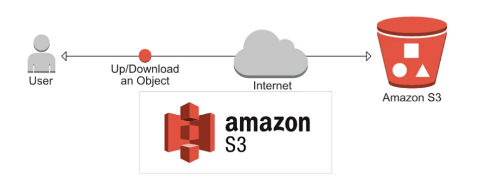
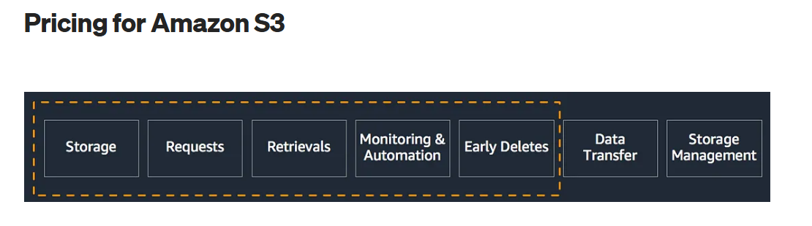
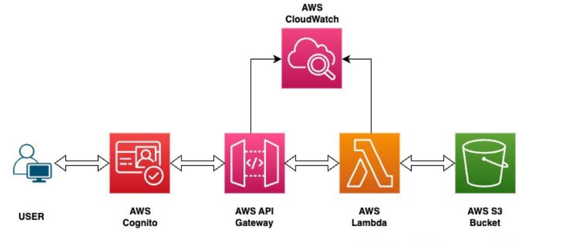

### 03. S3 (Simple Storage Service)

* **Title:**
Reliable and scalable storage for everyone with S3
&nbsp;
* **Introduction:**
S3 is a cloud storage service that stores files, backups, and data securely. It is scalable, cost-effective, and designed for all sizes of businesses.

&nbsp;
* **What is S3 (Simple Storage Service) ?**
S3 is a storage service where to upload, store, and retrieve any type of file. It is widely used for storing data like images, videos, documents, and backups.
&nbsp;
* **Key Features:**
1. Unlimited Storage for user
2. Keeps multiple versions of a file for backup and recovery.
3. Encryption to protects stored data with strong security features.
4.  Lifecycle Management with automatically moves data to cheaper storage as it gets older.
5. Access Control to manage permissions for who can access your files.
&nbsp;
* **How It Works:**
Files are stored in containers called "buckets." Each file is uploaded with a unique name, and users can access it through a URL or download it using S3 tools.

&nbsp;
* **Benefits:**
Scalability and durability
&nbsp;
* **Use Cases:**
Backing up important files and databases. Hosting static websites, like company portfolios or personal blogs.
&nbsp;

* **Integration:**
S3 works well with other services like CloudFront for faster delivery of files, Lambda for automated file processing, and IAM for controlling access.
&nbsp;
* **Getting Started:**
Create a bucket in the S3 dashboard and then upload files, set permissions, and access them through their URLs.
&nbsp;
* **Best Practices:**
Use bucket policies and IAM roles to manage access securely.
Enable versioning to recover files if accidentally deleted.
&nbsp;
* **Challenges and Solutions:**
Costs can increase with large amounts of data stored. However use lifecycle policies to move old data to cheaper storage classes.
&nbsp;
* **Pricing Overview:**
S3 charges for the amount of data stored, requests made, and data transferred out. Storage classes like S3 Standard cost more, while S3 Glacier is cheaper for long-term storage.

&nbsp;
* **Case Studies:**
A photo-sharing app uses S3 to store and deliver millions of images to users. It ensures files are always available and loads them quickly.

&nbsp;
* **Conclusion:**
S3 is a simple and effective way to store and access files securely in the cloud that offers flexibility, reliability, and tools to manage data efficiently.
&nbsp;