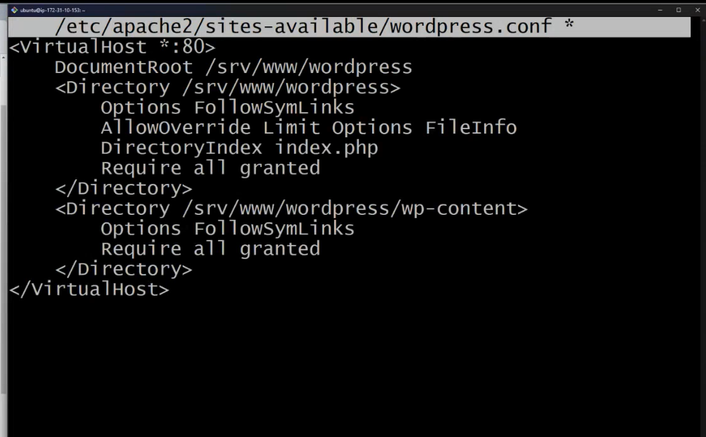

### <u>**D6 04.02.25**</u> - Three-Tier Architecture and Scaling in AWS

#### **1.Three-Tier Architecture**
* Presentation Layer (Front end): User interface (HTML, CSS, JavaScript).
* Logic Layer/Backend : Backend processing (LAMP stack - Linux, Apache, MySQL, PHP).
* Data Layer: Database management (MySQL on RDS).

Example : In an e-commerce company, when promoting a product, an EC2 instance will host the three-layer architecture, as shown in the picture below.

#### **2.Scaling Methods:**
* Vertical Scaling: Increase RAM/CPU on one server.

* Horizontal Scaling: Use many servers with a Load Balancer.

#### **3.Traditional vs. Modern Approach in AWS**

  **Traditional Way - Using EC2 for Everything**
* Use EC2 instance runs all three layers (frontend, backend, database).
* Having issue of High cost for always running instances, hard to scale during high traffic and more maintenance for OS updates and security.

**New Way - Serverless with AWS resources - auto scales**
* Frontend: Static files in S3 + CloudFront (CDN).
* Backend: Lambda functions replace EC2 for API requests.
* Database: Managed RDS for MySQL or DynamoDB.
* Habing advantages of Auto-scales with traffic, lower cost (pay only when used) and no server management (AWS handles everything).

#### **4.Planning and steps before start the WordPress project**
* Use Github to find the resouces the best approach
* Find out how to do it with documentation
* Learn how to configure the setup
* Find out how to deploy the environment
* Perform functionality testing

Then, follow these steps:
* Ready with the Git Souces Code
* Apache Server, PHP, MySQL (LAMP Stack)
* Launch EC2
* Run test cases to verify functionality
* Validate the implementation
* Repeat the process if needed

* 

#### **5.Hands-on Deploy WordPress on AWS**
1. Once get ready everything above, start with deploy a EC2 with Ubuntu OS, SSH key and security group that allow SSH, HTTP and HTTPS.
&nbsp;
2. Right click Bash on the PAM key and enter Bash , then copy the SSH key from EC2 AWS platform.
&nbsp;
3. Once in connect to EC2 via SSH, verify git
**`git -v`** - verify git version

&nbsp;
4.  **`sudo apt update -y`**
Instructs the system to refresh the list of available software packages and their versions from the configured repositories

&nbsp;
5.  **`sudo apt upgrade -y`**
Instructs the system to download and install the latest available updates for all currently installed packages on the system
&nbsp;
6. Installing Apache:
https://ubuntu.com/tutorials/install-and-configure-apache#2-installing-apache
**`sudo apt install apache2`**

&nbsp;
7. Install Dependencies
From website https://ubuntu.com/tutorials/install-and-configure-wordpress#2-install-dependencies key in command below to Install Dependencies
**`sudo apt update
sudo apt install apache2 \
                 ghostscript \
                 libapache2-mod-php \
                 mysql-server \
                 php \
                 php-bcmath \
                 php-curl \
                 php-imagick \
                 php-intl \
                 php-json \
                 php-mbstring \
                 php-mysql \
                 php-xml \
                 php-zip`**

&nbsp;
8.Install WordPress
Create the installation directory and download the file from
https://ubuntu.com/tutorials/install-and-configure-wordpress#3-install-wordpress
**`sudo mkdir -p /srv/www`**
**`sudo chown www-data: /srv/www`**
**`curl https://wordpress.org/latest.tar.gz | sudo -u www-data tar zx -C /srv/www`**

&nbsp;
9.Configure Apache for WordPress
Create Apache site for WordPress from https://ubuntu.com/tutorials/install-and-configure-wordpress#4-configure-apache-for-wordpress
**`cd /srv/www`**
**`ls`**
**`sudo nano /etc/apache2/sites-available/wordpress.conf`** with following lines:

Then copy information below into nano.

<VirtualHost *:80>
    DocumentRoot /srv/www/wordpress
    <Directory /srv/www/wordpress>
        Options FollowSymLinks
        AllowOverride Limit Options FileInfo
        DirectoryIndex index.php
        Require all granted
    </Directory>
    <Directory /srv/www/wordpress/wp-content>
        Options FollowSymLinks
        Require all granted
    </Directory>
</VirtualHost>

&nbsp;
10.  Enable the site with
    **`sudo a2ensite wordpress`**
&nbsp;
11. Run systemctl reload apache2 with
**`sudo systemctl reload apache2`**

12. Enable URL rewriting with:
**`sudo a2enmod rewrite`**

13. Finally, reload apache2 to apply all these changes:
**`sudo service apache2 reload`**

#### **6.Stop instance with AWS CLICLI**
To stop an AWS EC2 instance using the AWS CLI, use the following command:
* Go to AWS Console – Open AWS Management Console
* Click on CloudShell – Find the CloudShell icon (top-right corner).
* run command **`aws ec2 stop-instances --instance-ids i-xxxxxxxxxxxxxxxxx`**
