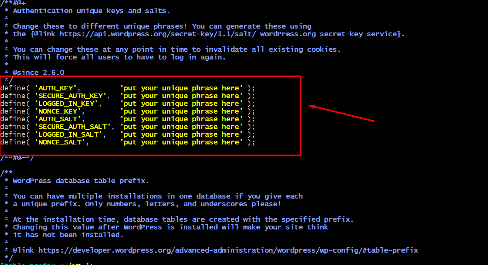

### <u>**D7 06.02.25**</u>
* **Continue configure database & configure WordPress to connect to the database**

#### 1. Start EC2 with Cloud CLI command AWS
Refer to the website https://docs.aws.amazon.com/cli/latest/reference/ec2/reboot-instances.html , enter command below to start the EC2 with Cloud CLI
**`aws ec2 start-instances --instance-ids i-xxxxxxxxxxxxxxxxx`**

The screenshot showing the instance status from stopped to pending.

#### 2. Configure database
According to the website https://ubuntu.com/tutorials/install-and-configure-wordpress , to continue configure WordPress, MySQL database creation is required.

a) Command to log into MySQL server with administrative privileges.
mysql> **`sudo mysql -u root`**

b) Command to create a new database named "wordpress" inside a database server
mysql> **`CREATE DATABASE wordpress`**

c) Command to create a new database user.
mysql>**`CREATE USER wordpress@localhost IDENTIFIED BY '<your-password>';`**

d) Command to grants specific permissions to the "wordpress" user in MySQL, allowing it to manage the "wordpress" database.

mysql>**`GRANT SELECT,INSERT,UPDATE,DELETE,CREATE,DROP,ALTER`**
        >**`ON wordpress.*`**
        >**`TO wordpress@localhost;`**

e) Command to reload the user privileges without restarting the database server.
mysql> **`FLUSH PRIVILEGES;`**

f) Command to quit the MySQL
mysql> **`quit`**
Bye

g) Command to start the MySQL database server
ubuntu@ip-xxx-xx-xx-xx:~$  **`sudo service mysql start`**

***

#### 3. Configure WordPress to connect to the database

a) Command to displays the contents of the wp-config.php file, which is the main configuration file for a WordPress site.
**`cat /srv/www/wordpress/wp-config.php`**

b) Copy the sample configuration file to wp-config.php:
**`sudo -u www-data cp /srv/www/wordpress/wp-config-sample.php /srv/www/wordpress/wp-config.php
`**

c) Set the database credentials in the configuration file (do not replace database_name_here or username_here in the commands below. Do replace <your-password> with your database password.):

* **`sudo -u www-data sed -i 's/database_name_here/wordpress/' /srv/www/wordpress/wp-config.php
`**
* **`sudo -u www-data sed -i 's/username_here/wordpress/' /srv/www/wordpress/wp-config.php
`**
* **`sudo -u www-data sed -i 's/password_here/<your-password>/' /srv/www/wordpress/wp-config.php
`**

d) Open the configuration file in nano:
**`sudo -u www-data nano /srv/www/wordpress/wp-config.php`**

Find the following:
define( 'AUTH_KEY',         'put your unique phrase here' );
define( 'SECURE_AUTH_KEY',  'put your unique phrase here' );
define( 'LOGGED_IN_KEY',    'put your unique phrase here' );
define( 'NONCE_KEY',        'put your unique phrase here' );
define( 'AUTH_SALT',        'put your unique phrase here' );
define( 'SECURE_AUTH_SALT', 'put your unique phrase here' );
define( 'LOGGED_IN_SALT',   'put your unique phrase here' );
define( 'NONCE_SALT',       'put your unique phrase here' );

Then replace with information from https://api.wordpress.org/secret-key/1.1/salt/ and replace the information as screenshot below. Please use `Ctrl+K` to delete row

`Ctrl+x`to leave nano and save it.
***
#### 4. Configure WordPress
Open http://YourPublicIpAddress to enter the configuration page as below:

