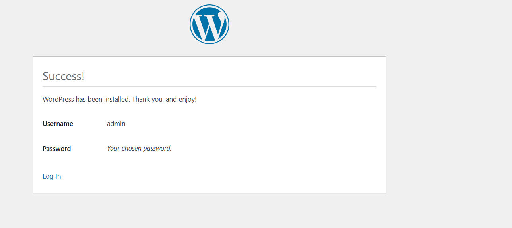
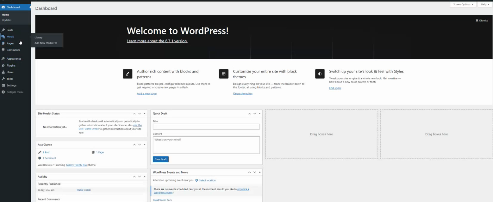
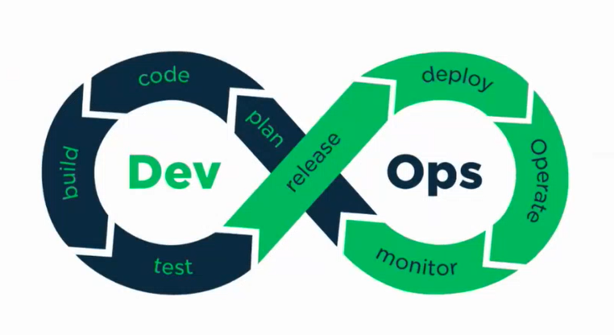
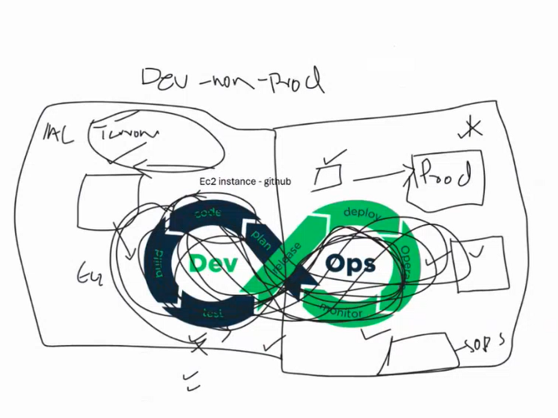
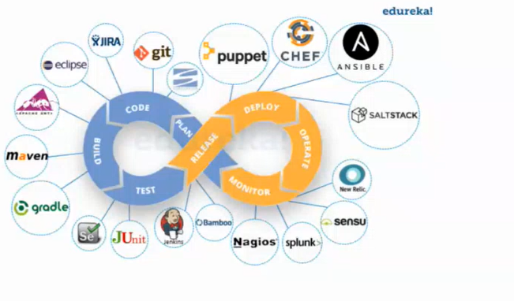

### <u>**D8 07.02.25**</u>
* **Review 15 topics and check on the works**
* **Discuss the Project Scope and Next Steps as below**

### 1. complete the Configuration of  WordPress
Continue from Day 7 on the configuration of Wordpress https://ubuntu.com/tutorials/install-and-configure-wordpress#7-configure-wordpress .

* Open http://(ec2 Public Ip address), then will direct to Wordpress configuration page .

* Then select the language and click continue. The page will show as below:

* Then login to the WordPress Dashboard

* Success logged into the dashboard

* Welcome to Wordpress Homepage

### 2. Use AWS CLI command to create EC2
* Refer to https://docs.aws.amazon.com/cli/latest/reference/opsworks/create-instance.html to create EC2

### 3. Use AWS CLI command to create Security group
* Refer to https://docs.aws.amazon.com/cli/latest/reference/ec2/create-security-group.html to create security group

### 4. Use AWS CLI command to install a web server on your EC2 instance
* Refer to https://docs.aws.amazon.com/AmazonRDS/latest/UserGuide/CHAP_Tutorials.WebServerDB.CreateWebServer.html to install a web server on your EC2 instance

### 5. Extra IT knowledge & Tips

* Learning AI is Essential
    * After 2022, access to AI tools for learning is ideal as it can simplify technical concept.
    * Spend more time on learning AI , the deployment methods and AI agents.
* DevOps Lifecycle - to show the continuous collaboration between Development and Operation teams in a project.

    * Plan: Define project requirements and objectives.
    * Code: Developers write and manage code.
    * Build: Compile and package the code.
    * Test: Perform automated/manual testing.
    * Release: Prepare the software for deployment.
    * Deploy: Deploy the application into production.
    * Operate: Maintain and manage the system.
    * Monitor: Track performance, detect issues, and improve.

* Continuous Integration (CI) → Automates coding, testing, and building.
* Continuous Deployment (CD) → Ensures frequent, reliable software releases.
* Feedback Loop → Improves software through monitoring and planning.

### 6. Project related
* Focus on teamwork and roles distribution
* Building a Product & Market Potential
* Be ready of the idea for the project
* Scope will be set on next meeting
