# Instructions for SDS Chatbot Deployment on AWS
📌 **Created by:** Amit Charan
🔧 **Modified by:** Amit Charan & Lee Yit Phang
✍ **Transcribed by:** Lee Yit Phang
📅 **Last Updated:** 2025-03-07

The following instructions are for building an SDS voice chatbot using AWS services.

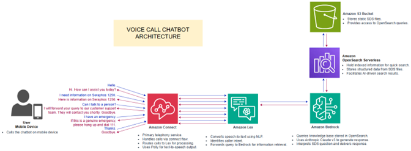
## Prerequisites:

- A collection of SDS source files in PDF format for the chatbot to retrieve information.
- An AWS Free Tier account (with billing enabled).
- IAM user account with administrator access.

---

## IAM User Instructions

1. **Sign in** to the AWS Management Console as the root user.
2. **Search for ‘IAM’** in the AWS Management Console search bar.
3. In the IAM dashboard, click **‘Users’** and then **‘Create user’**.

   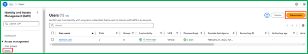

**Specify user details:**
   - User name e.g., `sds-chatbot-user`.
   - Tick box for **‘Provide user access to the AWS Management Console’** and select **‘I want to create an IAM user’**.
   - Create a custom password or use an autogenerated password. Tick box for **‘Users must create a new password at next sign-in’** for security.
   - Click **‘Next’**.

   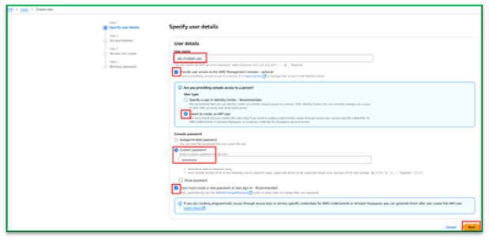

4. **Set permissions:**
   - Attach policies to the IAM user. **‘AdministratorAccess’** will give access to all necessary privileges needed to deploy the chatbot. Alternatively, the following permissions can be added to restrict full administrator access:
     - `AmazonBedrockFullAccess` – grants full access to Amazon Bedrock services.
     - `AmazonS3FullAccess` – grants full access to Amazon S3 buckets.
     - `AmazonOpenSearchServiceFullAccess` – grants full access to Amazon OpenSearch.
     - `AmazonConnect_FullAccess` – grants full access to Amazon Connect instances.
     - `AmazonLexFullAccess` – grants full access to Amazon Lex bots.
     - `IAMFullAccess` – grants full access to IAM services.
   - Click **‘Next’**.

   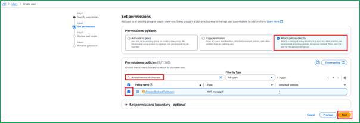

5. **Review permissions** and click **‘Create user’**.

   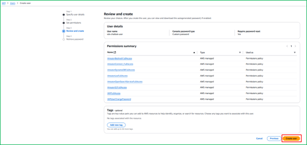

6. **Download the CSV file.** This file contains the new user's credentials (username, password, and console sign-in URL). Store this securely.

   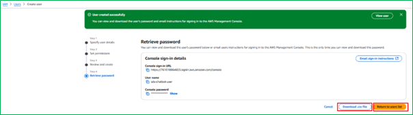

* **For account security, add MFA** to the IAM user. Click on the created user and select **‘Enable MFA’**.

   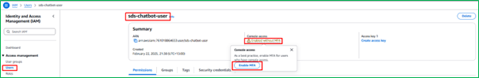

* **Set up MFA.**

   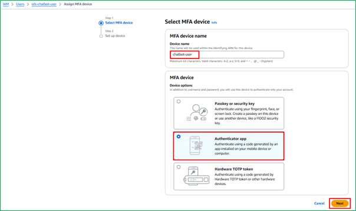
   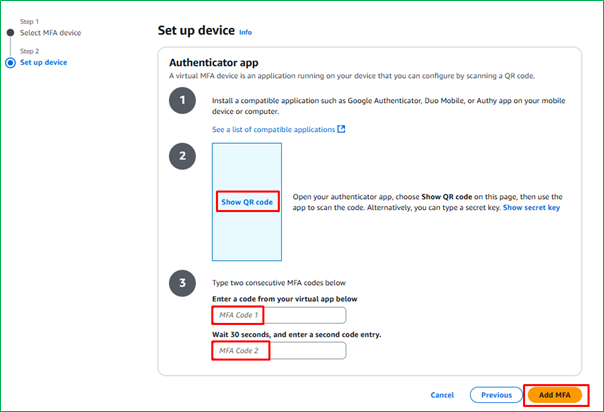

---

## **Chatbot Instructions**

### **Login**
- Use the console sign-in URL from the CSV file to log in to the AWS Management Console as the new IAM user.
- Set the AWS region to **Sydney (ap-southeast-2)** in the top right corner of the AWS Management Console.

---

## **Safety Data Sheets (SDS) in Amazon S3**

1. **Search and select ‘S3’** in the console. Click **‘Create bucket’**.

   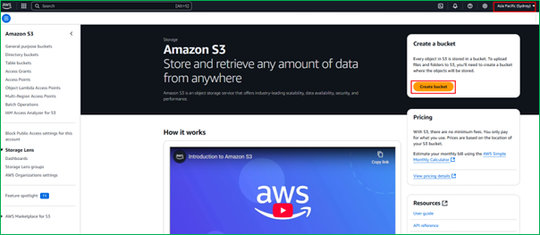

2. **Specify bucket details:**
   - Bucket name e.g., `sds-chatbot-YOURNAME-syd`. This must be unique.
   - AWS Region: **‘Asia Pacific (Sydney) - ap-southeast-2’**.
   - Tick box for **‘Block Public Access’**.

   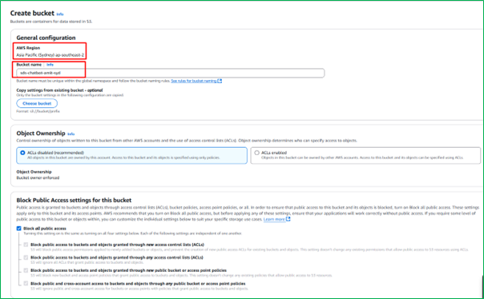

   Leave all other settings as default and click **‘Create bucket’**.

   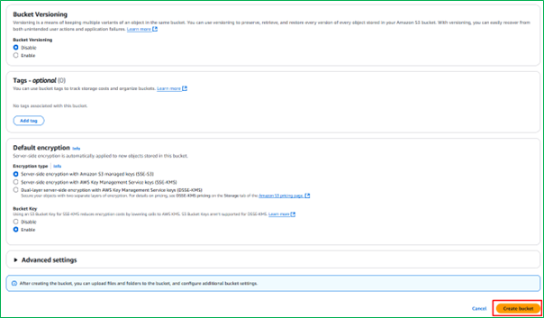

3. In the S3 console, click the created bucket.

   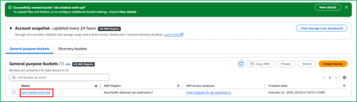

   * Click **‘Upload’** and then **‘Add files’** to select the SDS PDF files to upload.

   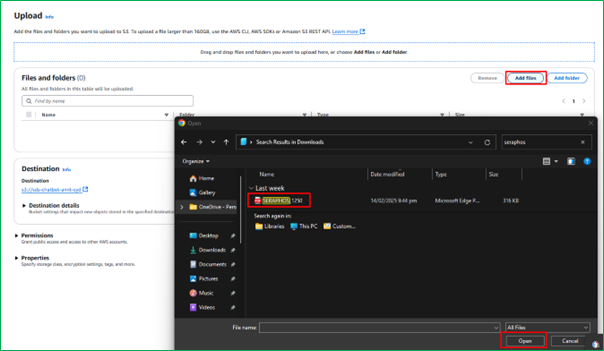

   * Click **‘Upload’**.

   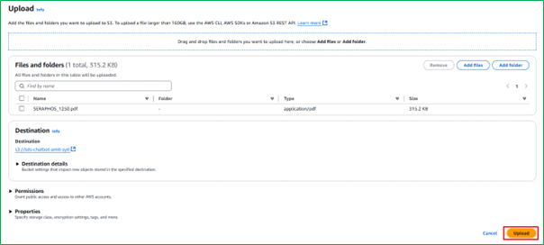

---

## **Knowledge Base in Amazon Bedrock**

1. **Search and select ‘Amazon Bedrock’** in the console.
2. Click on **‘Model catalog’** and request access for **‘Anthropic Claude 3’** and **‘Titan Text Embeddings V2’**.

   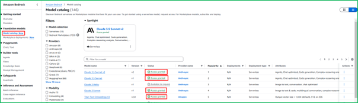

3. Click **‘Knowledge Bases’** and then **‘Create Knowledge Base’**. Select **‘Knowledge Base with vector store’**.

   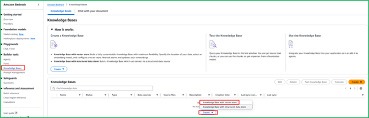
Note: Amazon OpenSearch Serverless is the vector store which deposits and retrieves vector embeddings of the text data. Embeddings is the semantic meaning of the text.  Amazon Bedrock uses these embeddings to find relevant information in the SDS files to answer user queries correctly.

4. **Specify the Knowledge Base details:**
   - Name e.g., `sds-kb-YOURNAME`.

   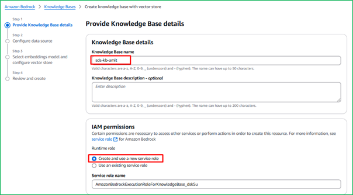
   Note: Do not make any changes to the service role name to prevent errors.

   * **Select ‘Amazon S3’** as the data source.

   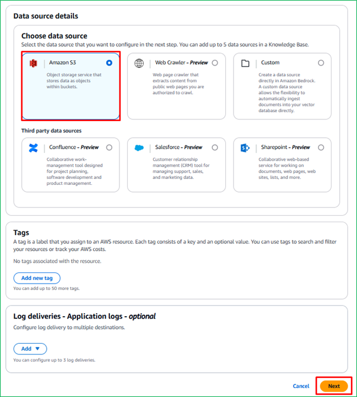

   * **Data source name:** e.g., `sds-kb-YOURNAME-ds`.
   - Browse and select the S3 URL for the S3 bucket e.g., `s3://sds-chatbot-YOURNAME-syd`.
   - Click **‘Next’**.

   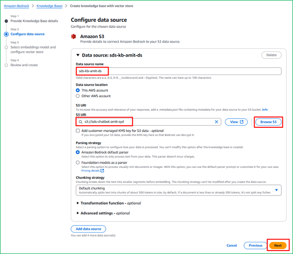

5. Click **‘Select Model’** and choose **‘Titan Text Embeddings V2’**.

   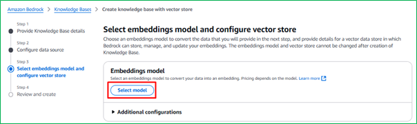
   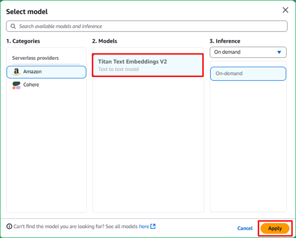

   * Click **‘Apply’**.
6. Click **‘Create new vector store’** and then **‘Amazon OpenSearch Serverless’**. Click **‘Next’**.

   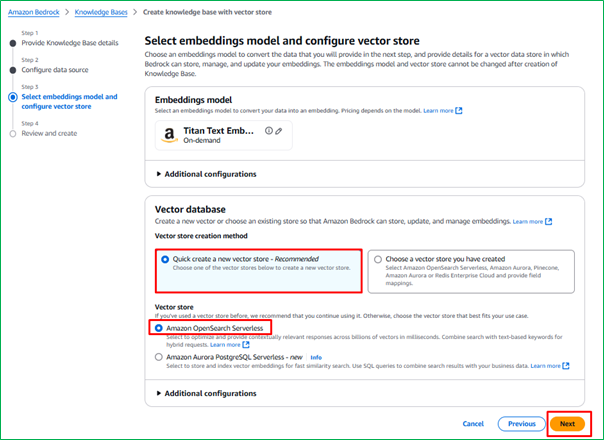

7.  Click **‘Create Knowledge Base’**. This process can take several minutes.

    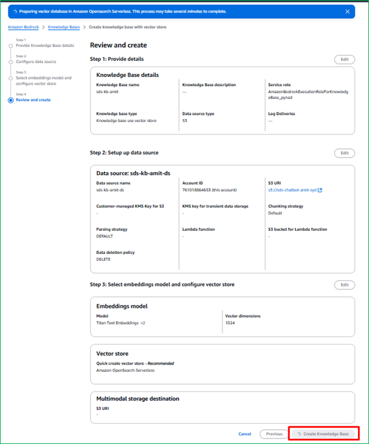
Note: if the error "Access denied to aoss:CreateAccessPolicy” occurs check the IAM user has ‘AdministratorAccess’ permission.
8.  **Open the created data source**, e.g., `sds-kb-YOURNAME` and click **‘Sync’** to synchronize the knowledge base to the S3 bucket..

    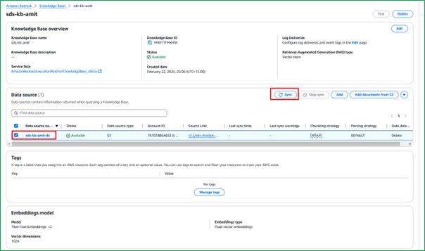

---

## **Amazon Lex Chatbot**

1. **Search and select ‘Lex’** in the console. Click **‘Create bot’**.

   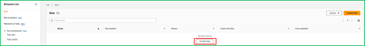

   * **Choose ‘Create a blank bot’.**
   - Bot name: e.g., `SDS_Chatbot`
   - IAM Permissions: **‘Create a new role with basic Amazon Lex permissions’**.
   - COPPA: **‘No’**.
   - Click **‘Next’**.

   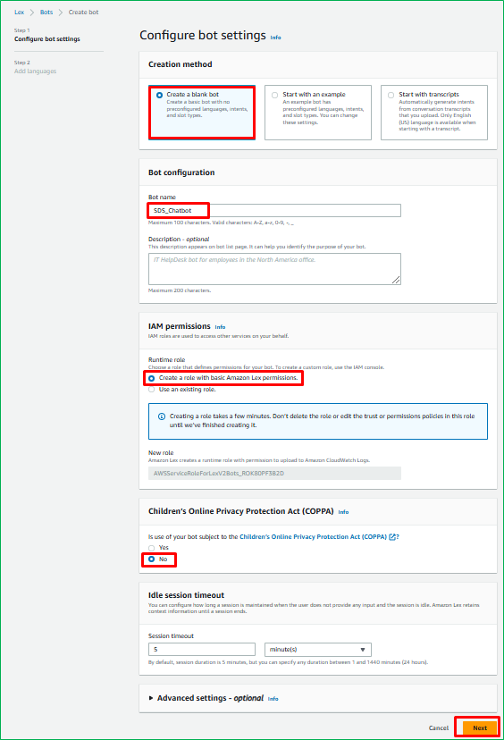

   * **Language:** `English`.
   - Voice iteration: e.g., `Matthew` (Note: Polly does not use this voice in the final chatbot).
   - Click **‘Done’**.

   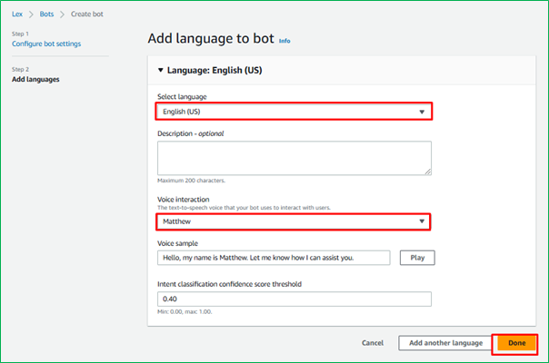
---

## Intents for Conversation

### Welcome Intent

1. Go to Intents, click ‘Add intent’, then ‘Add empty intent’.

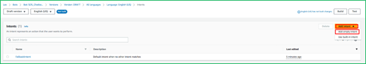

2. **Intent name:** `welcome_intent`.

3. **Add Sample utterances** (phrases the caller would say to initiate the conversation):

- "Hello"
- "Hi"
- "Hey there"

4. For the **initial response** (phrase the chatbot says to probe the conversation), add message:

> "Hi! Welcome to SDS Safety. How can I assist you today?"

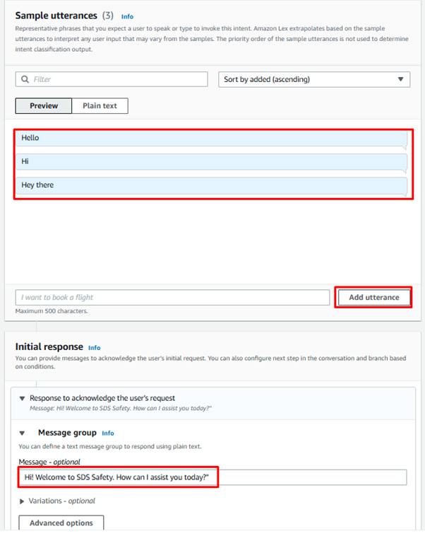

5. Click **‘Advanced Options’**, then **‘Next Step in conversation’**, choose **‘Wait for users input’**. Click **‘update options’**.

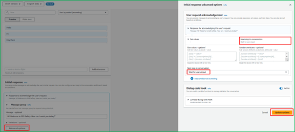

6. Click **‘Save Intent’**.

---

### Safety Intent

1. Click ‘Add intent’, then ‘Use built-in intent’.

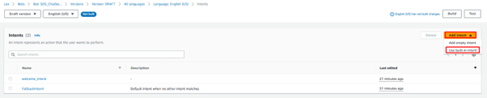

2. Choose **‘Amazon QnAIntent (Gen AI feature)’**.

3. **Intent Name:** `SafetyIntent`.

4. Click ‘Add’.

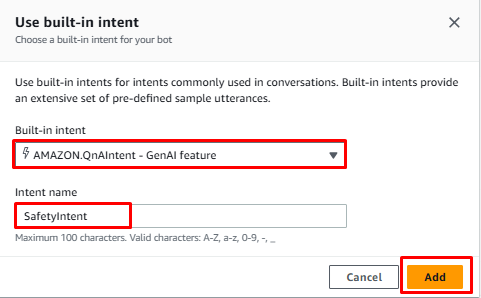

5. Select model **‘Anthropic’, ‘Claude3 Sonnet’**.

6. Select **‘Knowledge base for Amazon Bedrock’**. Copy the **Knowledge Base ID** and paste it into ‘Knowledge base for Amazon Bedrock Id’.

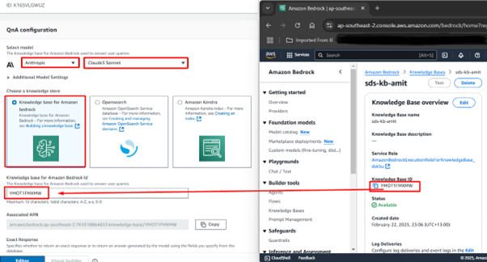

**7. Add Sample utterances:**

- "I need safety data."
- "Show me the SDS."
- "What is Seraphos 1250 used for?"
- "Who is the manufacturer of Seraphos 1250?"
- "What is the HSNO approval number for Seraphos 1250?"
- "How should I contact the supplier in case of an emergency?"
- "What hazards are associated with Seraphos 1250?"
- "What is the flash point of Seraphos 1250?"
- "What are the environmental risks of Seraphos 1250?"
- "How should Seraphos 1250 be stored safely?"
- "What are the proper precautions to take when handling Seraphos 1250?"
- "Can Seraphos 1250 be used in confined spaces or should it be used in well-ventilated areas?"
- "What should I do if I get Seraphos 1250 on my skin?"
- "What are the first-aid steps if Seraphos 1250 is inhaled?"
- "How should I treat someone who has swallowed Seraphos 1250?"
- "What type of fire extinguishing agents are recommended for Seraphos 1250?"
- "What should be avoided when fighting a fire involving Seraphos 1250?"
- "What personal protective equipment (PPE) should be worn when handling Seraphos 1250?"
- "What type of gloves are recommended when working with Seraphos 1250?"
- "Is respiratory protection required when handling Seraphos 1250?"
- "How should spills of Seraphos 1250 be cleaned up?"
- "How can I prevent Seraphos 1250 from contaminating water supplies?"
- "What environmental precautions should be taken when using Seraphos 1250?"
- "What is the acute toxicity of Seraphos 1250 if ingested?"
- "What is the environmental impact of Seraphos 1250 on aquatic life?"
- "Is Seraphos 1250 bioaccumulative?"
- "How should I dispose of Seraphos 1250 safely?"
- "Can I recycle containers that have been used for Seraphos 1250?"
- "What is the shipping classification for Seraphos 1250?"
- "What are the transport restrictions for Seraphos 1250?"

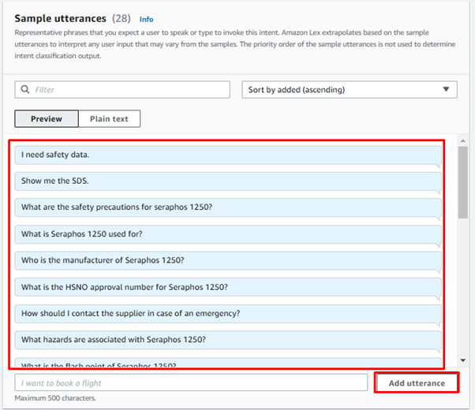

8. Click **‘Save Intent’**.

---

### Emergency Intent (Optional)

1. Click ‘Add intent’, then ‘Add empty intent’.

2. **Intent Name:** `EmergencyIntent`

3. **Add Sample utterances:**

   - "Emergency"
   - "I have an emergency"
   - "This is an emergency"

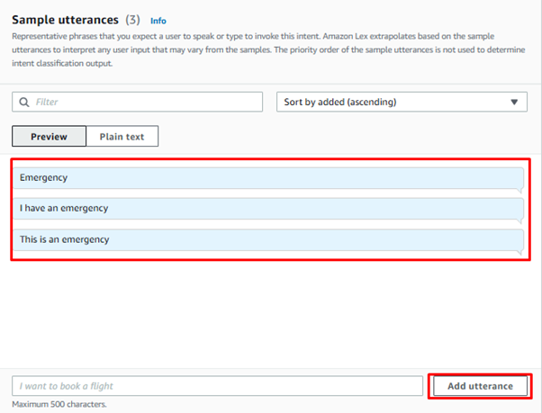

4. For the **initial response** add message:

> "If this is a genuine emergency, please hang up and dial 111."

5. Click ‘Advanced Options’, then ‘Next Step in conversation’, choose **‘End conversation’**. Click ‘update options’.

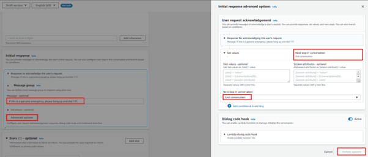

6. Click **‘Save Intent’**.

---

### Fallback Intent

1. Click **‘FallbackIntent’**. This is created by default but can be configured.

2. For the **initial response** add message:

> "I'm sorry, I didn't understand your request. Could you please rephrase it?"

3. Click ‘Advanced Options’, then ‘Next Step in conversation’, choose **‘Wait for users input’**. Click ‘update options’.

---

### Goodbye Intent

1. Click ‘Add intent’ then ‘Add empty intent’.

2. **Intent Name:** `goodbye_intent`.

3. **Add Sample utterances:**

   - "Goodbye"
   - "Thanks"
   - "See you later"

4. For the **initial response** add message:

> "You're welcome! Goodbye."

5. Click ‘Advanced Options’, then ‘Next Step in conversation’, choose **‘End conversation’**. Click ‘update options’.

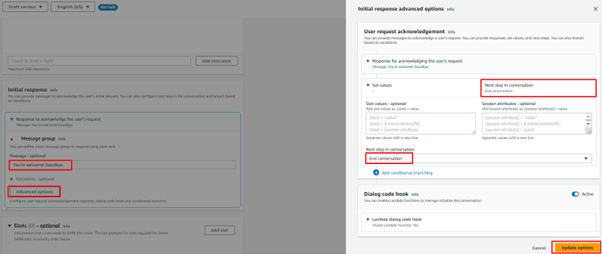

6. Click **‘Save Intent’**.

---
## Agent Referral Intent (Optional)

1. Click ‘Add intent’ then ‘Add empty intent’.

2. **Intent Name:** `agent_referral_intent`.

3. **Add Sample utterances:**

   - "I still need help"
   - "Connect me to support"
   - "Talk to a person"

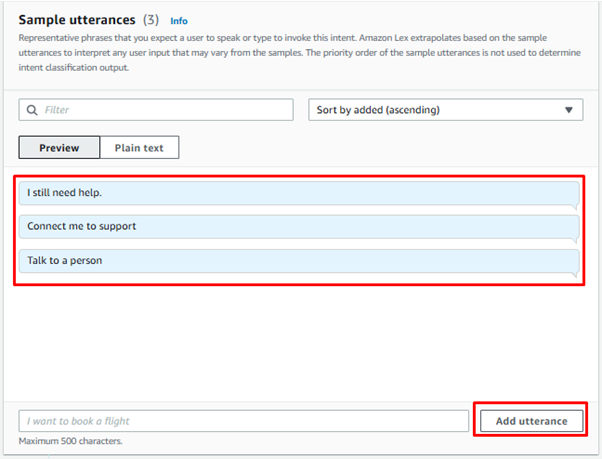

4. For the **initial response** add message:

> "I will forward your query to our customer support team. They will contact you shortly. Goodbye."

5. Click ‘Advanced Options’, then ‘Next Step in conversation’, choose **‘End conversation’**. Click ‘update options’.

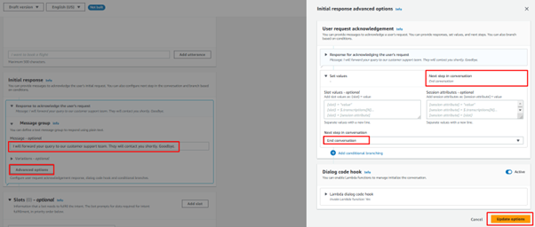

6. Click **‘Save Intent’**.

7. Click **‘Build’**.

8. 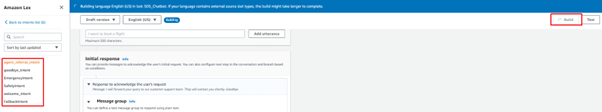

Once complete, click **‘Test’**. Enter phrases/questions in the **‘Test Draft version’** panel to check that the chatbot is responding correctly and providing information from the SDS files accurately. Use sample phrases/questions like:

- "What are the safety precautions for Seraphos 1240?"
- "Emergency"
- "I need to speak to someone"

9. If the chatbot provides correct responses, proceed to **AWS Connect setup**.

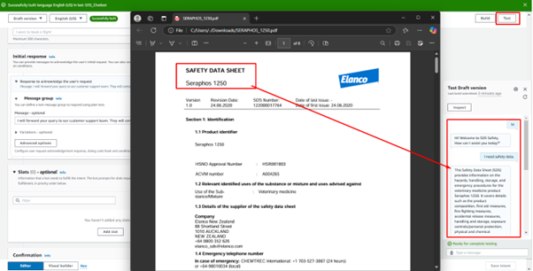
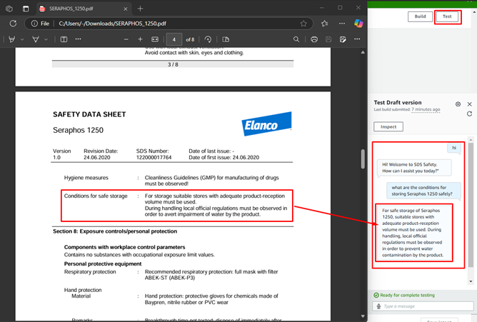
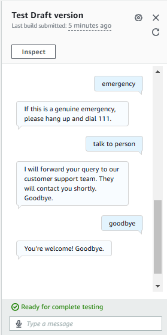
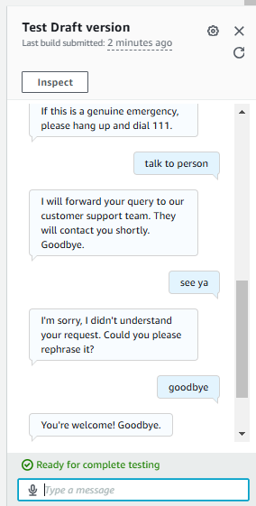

---

## Create Amazon Connect Instance (Phone Integration)

1. Search and select **‘Connect’** in the console. Click **‘Add an instance’**.

    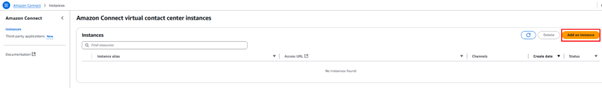

2. Select **‘Store users in Amazon Connect’** and create a custom access URL, e.g.
   `https://sds-support-YOURNAME.my.connect.aws`

    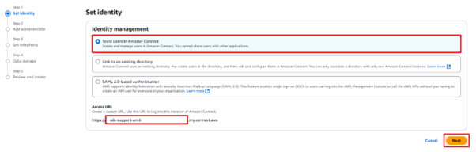

3. **Add administrator credentials:**
   - **Username:** `admin`
   - **Password:** *(Set a secure password that will be used to log in to the connect instance.)*

   * Click **‘Next’**.

    

4. Enable **Telephony Options**. Click **‘Next’**.

    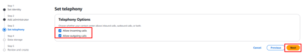
    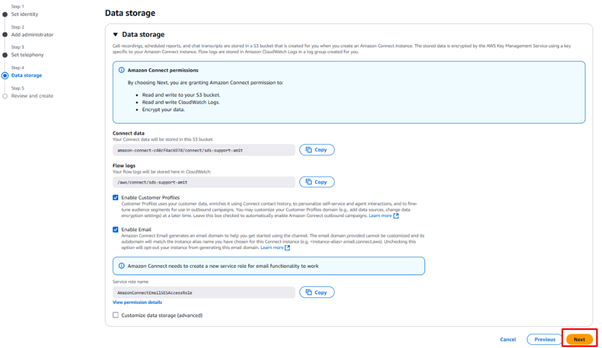

5. Keep default settings and click **‘Create Instance’**.

**Note:** If an error occurs when creating a Connect instance, there could be a password mismatch. Delete any partial instance and then recreate the Connect instance.

6. Select the **Connect instance** e.g. `sds-support-YOURNAME`. Click on **‘Flow’**.

   - **Region:** Asia Pacific Sydney region.
   - **Bot:** `SDS_Chatbot`.
   - **Alias:** `TestBotAlias`.

    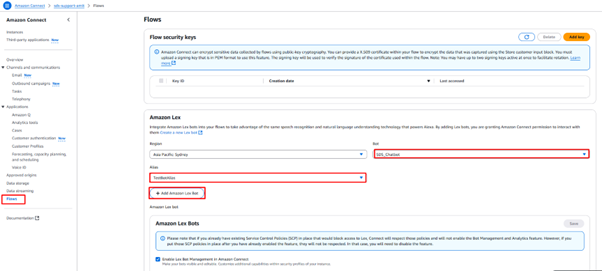

---
## Create a Contact Flow
1. In the **Connect instance overview**, click on the **Access URL** which will open the login page in a web browser. Enter the admin credentials (set previously) to log in to the Connect instance.

    

2. Go to **‘Flows’** and click **‘Create flow’**.

    

2. **Name:** `SDS Safety Flow`.

3. **Add a Play prompt** from the Block Library and drag it to the workspace. Click on the 3 dots to edit settings.
   - Select **‘Text-to-speech or chat text’**.
   - Add text:
     > "Welcome to the SDS Safety Support. How can I assist you?"
   - Click **‘Save’**.

    

4. **Add a Get customer input prompt** from the Block Library and drag it to the workspace. Click on the 3 dots to edit settings.
   - Select **Amazon Lex tab**.
   - **Select a Lex Bot:** `SDS_ChatBot`.
   - **Select Alias:** `TestBotAlias`.

    

   - Select **‘Text-to-speech or chat text’**.
   - Add text:
     > "Please describe your safety query."
   - **Intent:** `SafetyIntent`.
   - Click **‘Save’**.

    

6. **Add a Disconnect prompt** from the Block Library and drag it to the workspace.
7. Ensure the prompts are linked correctly so the conversation flows.
8.  Link the **‘Errors’** from each prompt to the **‘Termination Event’**.
9.  Click **‘Save’** and **‘Publish’**.

    

---

## Assign a Phone Number

1. Select **‘Channels’**, then **‘Phone Numbers’**.
2. Click **‘Claim a Number’**.

    

3. **Choose channel:** `Voice`
4. **Choose phone number:** `DID`, select local country (e.g., New Zealand) and pick a phone number.
5. **Choose Contact flow/IVR:** `SDS Safety Flow`.
6. Click **‘Save’**.

    

---

## Test the Chatbot via Phone

[ICTPro Chat Bot Demo (Youtube link)](https://www.youtube.com/watch?v=It6xVcQNV9M)

1. Dial the assigned phone number.
2. Ask the chatbot sample phrases/questions like:
   - "Hi"
   - "I want to know the conditions for storing Seraphos 1250."
   - "Emergency"
   - "Talk to a person"
   - "Goodbye"

**The chatbot should:**
- Provide a greeting.
- Ask for your safety query.
- Retrieve and interpret information from the SDS PDFs to answer questions.
- Respond to emergency phrases appropriately.
- Allow the user to request a support agent.
- Say goodbye and end the call.

---

## Delete Resources to Avoid Charges

**To avoid incurring charges, follow these steps to delete all resources:**

🚨 **DO NOT delete the Amazon Connect Instance** (as it has a phone number attached which can be utilized for further testing).

### **Delete the Amazon Lex Bot:**
- Go to **Amazon Lex service**.
- Select your bot (`SDS_Chatbot`).
- Click **Delete**.

### **Delete the Amazon Bedrock Knowledge Base:**
- Go to **Amazon Bedrock service**.
- Go to **Knowledge Base**.
- Select your Knowledge Base (`sds-kb-YOURNAME`).
- Click **Delete**.

### **Delete the Amazon OpenSearch Serverless collection:**
- Go to **Amazon OpenSearch service**.
- Select **Serverless**.
- Select each resource.
- Click **Delete**.

### **Delete the S3 Bucket:**
- Go to **S3 service**.
- Select your bucket (`sds-storage-YOURNAME`).
- **Empty the bucket**.
- Click **Delete**.

🔍 **Double-check that all resources have been successfully deleted.**
📊 **Monitor usage in Billing and Management the next day** to avoid unexpected charges.

---

## Considerations

- **AWS Free Tier:**
  All resources are free within limits except for OpenSearch. Be mindful of service limits and usage periods to avoid unexpected charges.

- **Resource Sizing:**
  Choose the appropriate resource size for OpenSearch to minimize costs.

- **Data Storage:**
  Use **S3 storage classes** for infrequently accessed data.

- **Tagging:**
  Add tags to each deployed resource for **identification** and **billing purposes**.

- **Phone Number Service Quota:**
  Only **5 numbers** are available on a Free Tier account. **Do not delete the Connect instance**.

---