# **Amazon Bedrock: Generative AI Simplified**

## **Purpose**

Amazon Bedrock is a fully managed serverless service that allows developers to build and scale generative AI applications using foundation models (FMs) from leading AI companies via a single API. Customer data remains private and is securely processed by the selected foundation model to generate outputs.  

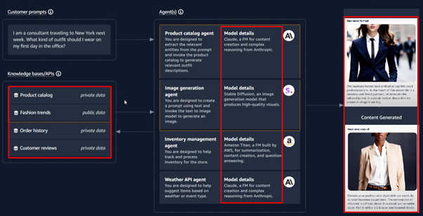

## **How It Works**

1. **Select Region:**
 - Foundation Models are available only in certain AWS regions.  
   

1. **Choose a Foundation Model:**
 - Review pre-trained foundation models such as **Anthropic**, **AI21 Labs**, **Stability AI**, and Amazon’s **Titan** models. These models can perform various tasks like text or image generation, summarization, and more.  

    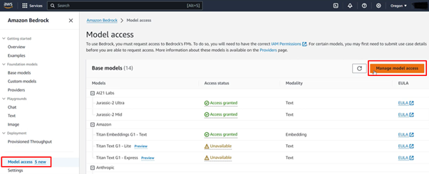

- Select the model. Certain models can take up to 72 hours to process requests.
   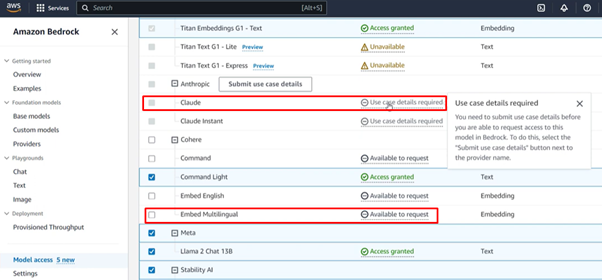

2. **Test Models:**
- **Chatbot Testing:**
     - Select a model.  
       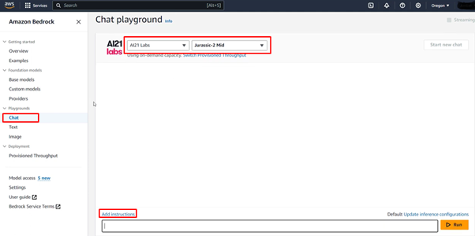
     - Set specific instructions for the model.  
       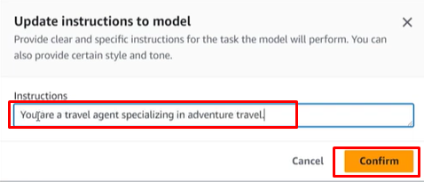
     - Enter prompts and review the generated responses.  
       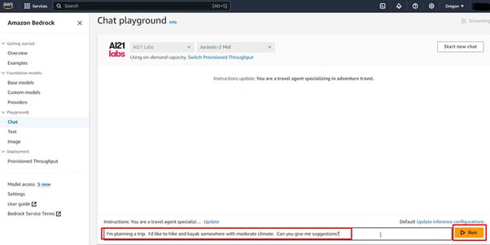
     - Configure default settings to control response behavior. Charges apply for extra tokens.  
       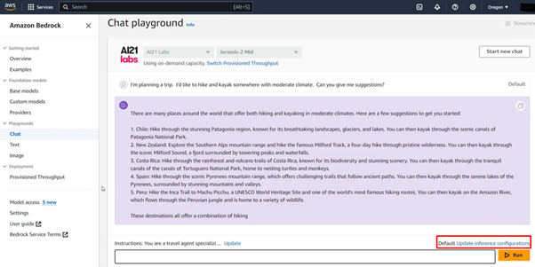  
       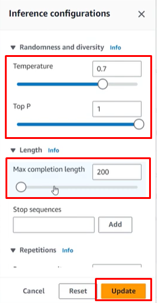
- **Text Generation:**  
       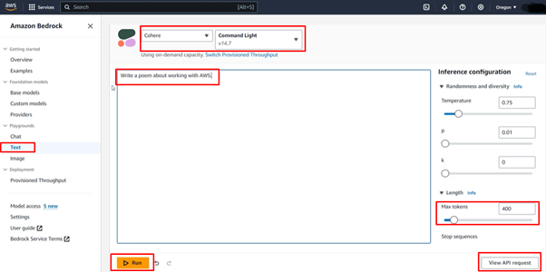
- **Image Generation:**  
       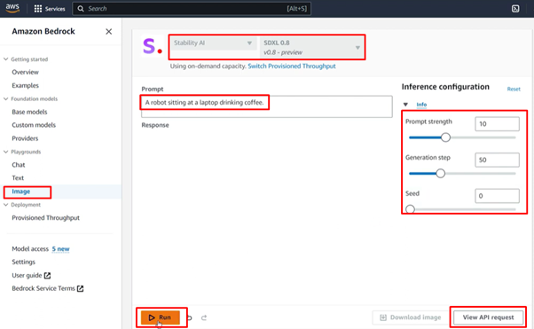

2. **Customize Models:**
- Fine-tune models with proprietary data to meet specific business requirements. Store data securely in an Amazon S3 bucket. Customization can add extra costs and requires experience.  
   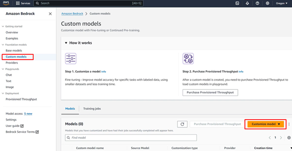

3. **Integrate via API:**
 - Embed generative AI functionalities into applications by invoking simple API calls within your code.  
   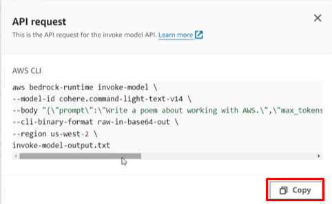  
   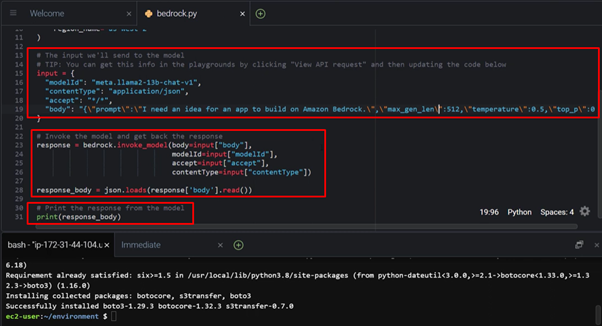

## **Features & Benefits**

1. **Foundation Model Variety:**
   - Choose from a range of foundation models tailored for specific generative AI tasks, with comprehensive documentation and sample code provided.

2. **Customization Made Easy:**
   - Fine-tune models using your own data to create solutions tailored to business needs.

3. **Serverless Functionality:**
   - Deploy generative AI applications without infrastructure investment.

4. **AWS Integration:**
   - Seamlessly integrate with other AWS services like Lambda and S3 to streamline workflows and data management.

## **Use Cases**

1. **Content Generation:**
   - Automate text and image generation for marketing, e-commerce, social media posts and blogs.

2. **Virtual Assistant:**
    - Build intelligent chatbots that engage in dialogue, respond to customer queries, and automate tasks.

3. **Data Summarization:**
   - Extract concise insights from large datasets, technical documents, books or meeting transcripts.

4. **Productivity Tools:**
   - Develop task driven, AI-powered tools to enhance workflow efficiency.

## **Pro Tips**

1. **Experiment with Models:**
   - Test multiple foundation models to find the best fit for specific project outcomes.

2. **Data Privacy:**
   - Utilize Amazon Bedrock’s secure environment to maintain proprietary data privacy during model customization.

## **Common Issues**

1. **Model Selection:**
   - Choosing the right model can be difficult without adequate experimentation.

2. **Poor Data Quality:**
   - Low-quality data during customization may lead to biased or inaccurate results.

3. **Cost Management:**
   - High-volume token usage can lead to high costs without proper monitoring.

## **Pricing**

1. **Model Customization:**
   - Fine-tuning models incurs charges based on the size of the dataset and processing time.

2. **On Demand:**
   - Charges vary depending on the model type:
     - **Text Models:** Charged based on the number of input tokens processed and output tokens generated. A token represents a unit of text (e.g., a word or part of a word)
     - **Image Models:** Charged based on the number of images generated.

3. **Provision Throughput:**
   - Hourly charges apply for purchasing model units for consistent usage, with commitment options ranging from 1 to 6 months.

