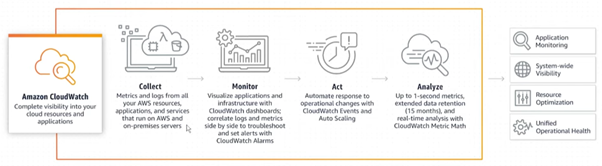
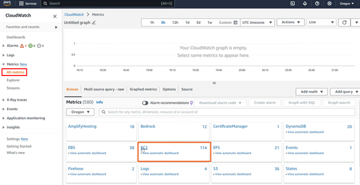
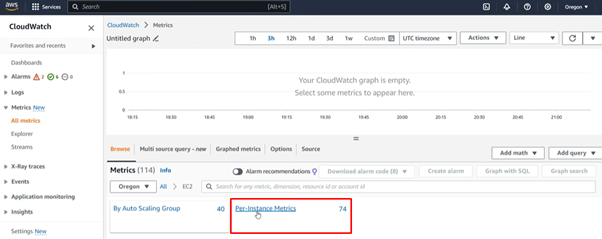
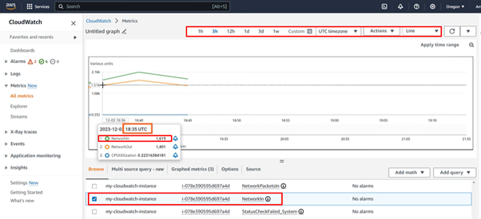

# **AWS CloudWatch: Monitoring Service**

## **Purpose**

AWS CloudWatch is a service that monitors the operational health of cloud resources, applications, and services. It provides metrics, logs, and alarms, allowing you to respond to operational changes in real-time.

## **How It Works**

1. **Collect Metrics:**
   - Gather and visualize performance data (e.g., CPU utilization, memory usage, disk activity, bandwidth) from AWS services and applications.

2. **Set Alarms:**
   - Create alarms that trigger when a metric threshold is met, activating automated functions such as Lambda, auto-scaling, or SNS notifications.

3. **Analyze Monitor Logs:**
    - Use CloudWatch Logs Insights to query log groups over specific time ranges, providing detailed information from AWS services, applications, and on-premises servers.

## **Features & Benefits**

1. **Comprehensive Metrics:**
   - Proactively monitor services (e.g., EC2, RDS, Lambda, S3) and custom metrics to troubleshoot operational problems.

2. **Centralized Logging:**
   - Collect, search, and visualize logs to gain insights into system operations and performance.

3. **Dashboards:**
    - Create real-time, customizable dashboards for an integrated global view of your systems.

4. **Alarms and Notifications:**
   - Receive notifications for potential issues via email, SMS, or application endpoints using SNS. Automate responses to critical alarms.

## **Use Cases**

1. **Performance Monitoring:**
   - Monitor resource performance, such as EC2 instance health, application performance, and database optimization.

2. **Troubleshooting:**
   - Analyze real-time metrics, logs, and user requests to identify root causes of system failures and accelerate debugging.

3. **Cost Optimization:**
   - Monitor resource usage and set alerts for underutilized or overutilized resources to manage costs effectively.

4. **Website Testing:**
   - Analyze website traffic, logs, and web requests to ensure smooth functionality. 

## **Pro Tips**

1. **Set Up Alarms:**
   - Create alarms for critical metrics (e.g., CPU and memory usage) to proactively identify performance issues.

2. **CloudWatch Agent:**
   - Install the CloudWatch Agent on servers for advanced metrics like memory, disk, and application-level performance.

4. **Log Retention:**
   - Adjust log retention policies to avoid unnecessary storage costs.

## **Common Issues**

1. **Metric Overload:**
   - Managing large volumes of metrics can be overwhelming without filtering or grouping.

2. **High Costs:**
   - Storing and analyzing logs in large environments can be costly if not optimized.

## **Pricing**

1. **Metrics:**
   - Default basic metrics (published at 5-minute intervals) are free.
   - Detailed metrics (published at 1-minute intervals) are charged per metric.

2. **Logs:**
   - Charged on log data consumed, stored, and retrieved for analysis.

3. **Alarms:**
   - Charged per alarm and evaluation.

4. **Dashboards:**
   - Free for up to three dashboards per account with charges for additional dashboards.

