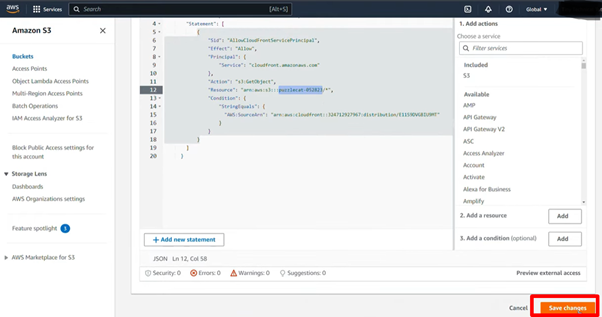

# **AWS CloudFront: Fast Content Delivery**

## **Purpose**

AWS CloudFront is a Content Delivery Network (CDN) service that securely delivers data, videos, applications, and APIs to users globally. It provides low latency and high transfer speeds by caching content at edge locations.

  

## **How It Works**

- **Define Origin:**  
  - Set up the origin (e.g., S3 bucket, EC2 instance) or a onpremise server and upload objects. The origin is where CloudFront retrieves objects for distribution and caches at edge locations.

- **Create CloudFront Distribution:**  
  - Configure a CloudFront distribution by specifying the origin domain where objects are hosted. The distribution serves these objects to users via a website or application.
 
  

- **Access Control and Security Settings:**  
  - Configure access controls like signed URLs or cookies, to secure private objects.
  
 
 - Use AWS WAF (Web Application Firewall) to block malicious traffic and protect against cyber attacks (e.g., SQL injection, XSS).
   
- **Default Root Object:**  
  - Specify a default root object (e.g., `index.html`) that CloudFront will return when users request the distribution's domain name without specifying an object.
   
- **Assign Public Access:**  
  - By default, S3 objects are private. To allow public access through CloudFront update the bucket policy for secure access.
   
      
         
            
               
                  

## **Features & Benefits**

1. **Global Edge Network:**  
   - CloudFront leverages over 600 edge locations globally to serve content closer to users, reducing latency and improving performance.
        

3. **Caching:**  
   - Customize caching policies to reduce the load on origin servers and ensure high availability for applications.

4. **Geo-Restriction:**  
   - Restrict content delivery based on geographic location to comply with local regulations or business requirements.

5. **Serverless at the Edge:**  
   - Lambda@Edge enables to run serverless functions closer to users improving performance by reducing latency.

## **Use Cases**

1. **Fast Website Access:**  
   - Accelerate the delivery of static and dynamic web content with caching and compression.

2. **Media Streaming:**  
   - Optimize on-demand and live video streaming for smooth playback across devices.

3. **API Optimization:**  
   - Improve API response times by caching frequently accessed results and reducing backend server load.

4. **Software Distribution:**  
   - Efficiently deliver large files, updates, and patches to global users.

## **Pro Tips**

- **Enable Compression:**  
  - Compress large objects improving load times and lowering bandwidth costs.

- **Leverage AWS Free Tier:**  
  - AWS CloudFront Free Tier offers up to 1 TB of free data transfer per month, making it ideal for testing and small-scale deployments.

- **Optimize security:**  
  - Protect applications by setting up AWS WAF to block malicious traffic or prevent common attacks like SQL injection and cross-site scripting (XSS).

## **Common Issues**

1. **Cache Invalidation:**  
   - Clearing cached content at edge locations can incur additional costs.  

2. **Complex Access Controls:**  
   - Implementing signed URLs and cookies requires proper key management and consistent updates across deployments.

4. **Cost Management:**  
   - Monitor data transfer and request rates to avoid high running costs.  

## **Pricing**

1. **Data Transfer:**  
   - Charged per GB transferred out from edge locations to end-users. Data transfers from AWS origins to CloudFront are free.

2. **Request Fees:**  
   - Charged for each HTTP/HTTPS request processed by CloudFront.  

3. **Cache Invalidation:**  
   - Free for the first 1,000 invalidation paths per month; additional paths incur fees.  

4. **Lambda@Edge:**  
   - Charged based on the number of executions and compute time. The free tier includes 1 million requests per month.

