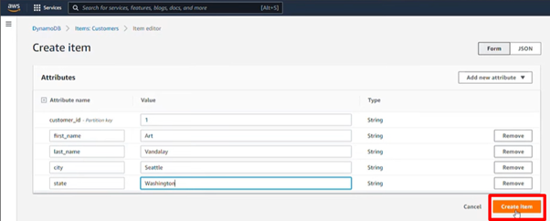

# AWS DynamoDB: Managed NoSQL Database Service  

## **Purpose**  

AWS DynamoDB is a fully managed NoSQL (non-relational) database service offering high availability, scalability, and low-latency data access. It is ideal for high traffic web applications, mobile apps, eCommerce and gaming that requires consistent performance at any scale, and IoT.

## **How It Works**  

### **1. Create a Table** 
   
   
   - Define table name and the partition key for the table in a region.
    
     - **Partition key**: A unique identifier for each item in the table (e.g., `OrderID`) 
     - **Sort key** (optional): Helps store and query multiple items with the same partition key (e.g., `CreationDate`). The primary key cannot be changed once the table is created.
  
  - Define read/write capacity settings - autoscaling or fixed.
     
   
   - Specify optional secondary indexes - global or local to enable efficient querying of non-key attributes and encryption at rest.
     

### **2. Add Items**
   - Go to the table and select explore table items.
    
      
   - Create item.

      

   - Define attributes in Form or JSON format.
    
    
    
   
DynamoDB stores the data in partitions and automatically replicates it across multiple Availability Zones for durability.  

### **3. Query and Scan Operations**
   - Use the `Query` operation to retrieve data using partition key and optional sort key.  
   - Use the `Scan` operation to retrieve all items from a table or secondary index (less efficient than `Query`).

        

## **Features & Benefits**  

1. **Scalability**:  
   - Automatically scales to meet application demands with no manual intervention.

2. **Fully Managed**:  
   - Handles provisioning, configuration, and operational tasks, allowing developers to focus on application logic.

3. **Low-Latency Performance**:  
   - Offers single-digit millisecond response times for consistent performance.

4. **Global Tables**:  
  - Build globally distributed applications with multi-region replication for low-latency access.

5. **Enhanced Security**:  
   - Encryption at rest and fine grained IAM policies offer data security.  

6. **Cost Efficiency**:  
   - Pay for the actual reads and writes performed based on throughput and storage consumed.  

## **Use Cases**  

1. **Web and Mobile Applications**:  
   - With Dynamo global tables applications can respond to events and serve traffic for e-commerce websites, social media platforms, and content management systems with fast, local read and write performance.  

2. **Gaming**:  
   - Manage user profiles, leaderboards, and game state data with fast and scalable reads and writes.

3. **Streaming Applications**:  
   - Enable personalized recommendations, watchlists, and real-time bookmarking.

4. **IoT Applications**:  
   - Store sensor data, device states, and logs with low-latency access and auto scaling to handle large data volumes.  

## **Pro Tips**  

- **Optimize Access Patterns:**  
   - Start with known query patterns to design effective primary keys and indexes.

- **Leverage DAX (DynamoDB Accelerator):**  
   - Use caching for read-intensive workloads to reduce latency.

- **Set Up Auto Scaling:**  
   - Enable automatic adjustment of read/write capacity to handle traffic spikes.

- **Monitor with CloudWatch**:  
   - Use AWS CloudWatch to monitor the health and performance of DynamoDB tables, track request rates, and set up alarms for operational issues.  

- **Utilize Time-to-Live (TTL):**  
   - Automatically delete expired data to save on storage costs.

## **Common Issues**  

1. **Hot Partition Issue:**  
   - Uneven access patterns can overload a single partition. High uniqueness of partition keys distribute data evenly across partitions.

2. **Scan Cost and Latency:**  
   - Scanning large tables is slow and costly. Use queries whenever possible.

3. **Item Size Limit:**  
   - Items are limited to 400 KB. Use S3 for storing large objects and store references in DynamoDB.

## **Pricing**  

- **Capacity Models:**  
   - **On-Demand:** Pay per request; ideal for unpredictable workloads.  
   - **Provisioned:** Pre-set read/write units; cost-effective for stable workloads.

- **Storage**:  
   - Charged per GB of data stored in DynamoDB, including indexes and backups.  

- **Free Tier**:  
   - 25 GB of storage and 25 write capacity units and 25 read capacity units per month are free for the first 12 months.  

