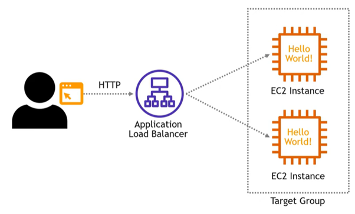

# **Elastic Load Balancer (ELB): Efficient Traffic Management**

## **Purpose**
Elastic Load Balancer (ELB) is a managed service that distributes incoming traffic across multiple targets, such as EC2 instances, containers, IP addresses, or Lambda functions, in one or more Availability Zones (AZ). It exposes a single point of access (DNS) to the application instead of directly exposing the targets. ELB ensures fault tolerance, high availability, and scalability by balancing traffic effectively. 

## **How It Works**

1. **Select Load Balancer Type:**
   - ELB offers multiple types of load balancers to cater to different use cases:  
       
       
     - **Application Load Balancer (ALB):** Operates at Layer 7 for HTTP/HTTPS traffic and supports advanced routing based on URLs or hostnames.  
     - **Network Load Balancer (NLB):** Operates at Layer 4, designed for high-throughput TCP/UDP traffic with low latency.
     - **Gateway Load Balancer (GWLB):** Operates at Layer 3, ideal for distributing traffic to third-party security appliances.  

2. **Security Group Settings:**
    - Create a Virtual Private Cloud (VPC) and define the Availability Zones (AZs).  
   
      
    - Define routing rules.
         

2. **Targets Group Settings:**
   - Create a target group with targets like EC2 instances, IP addresses, or Lambda functions. The load balancer routes traffic across healthy targets within the group.
    
    
    
    
    

4. **Health Checks:**
   - ELB regularly monitors the health of targets and routes traffic only to healthy ones.  Health checks are configured with a specific port and route (e.g., `/health`). If the response if not 200 (OK), the target is unhealthy.

5. **Distribute Traffic:**
 - Traffic is distributed across multiple targets in one or more AZs using the load balancer's internet-facing address to ensure consistent performance.  
    
    

## **Features & Benefits**

1. **Traffic Distribution:**
   - Efficiently balances traffic to prevent overload and downtime.

2. **High Availability:**
    - Automatically reroutes traffic to healthy targets across AZs, ensuring continuous service availability.  

3. **Elasticity:**
   - Scales automatically to handle traffic demand fluctuations without manual intervention.  

4. **Secure Communication:**
   - Supports HTTPS and SSL/TLS for secure data transmission.

## **Use Cases**

1. **Web Applications:**
   - Use ALB to distribute HTTP/HTTPS traffic across multiple instances or containers.

2. **High-Throughput Applications:**
   - Use NLB to handle large-scale TCP/UDP workloads with low latency.

3. **Hybrid Cloud Network:**
   - Use GWLB to distribute traffic across third-party virtual appliances, scaling them dynamically.  

## **Pro Tips**

1. **Select Correct Load Balancer:**
   - Select the correct load balancer to handle application requirements (e.g., ALB for http/https web apps, NLB for TCP/UDP high throughput).

2. **Enable Cross-Zone Load Balancing:**
   - Distribute traffic evenly across all targets in all enabled Availability Zones.

## **Common Issues**

1. **Misconfigured Health Checks:**
   - Incorrect health checks can route traffic to unhealthy targets causing application errors.

2. **Overprovisioning:**
   - Choosing the wrong load balancer type can increase unnecessary costs.

3. **Latency Issues:**
   - Inefficient network configurations or routing rules can create bottlenecks.

## **Pricing**

1. **Per Hour Usage:**
   - Charged based on the type of load balancer and the number of hours it is active.

2. **Data Processed:**
   - Charged based on the amount of data transferred through the load balancer.

