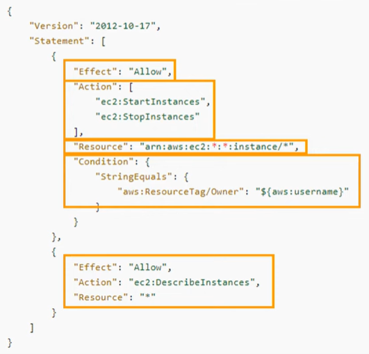

# **AWS IAM: Secure Access Management**

## **Purpose**

AWS Identity and Access Management (IAM) service is used to securely control access to AWS resources. It provides granular control over user authentication (who) and authorization (what they can do), ensuring users and resources have the correct level of access.

## **How It Works**

1. **Users and Groups:**
   - **Users:** Create IAM users needing AWS access. For best practice, create users in your IAM account not the root account. 
   

        Define user name for each user gets and select unique credentials (passwords or access keys).
     
     
     
     User credentials can be downloaded as CSV file or emailed to the user.
     
     

   - **Groups:** Group is a collection of IAM users. Create groups based on roles (e.g., Admins, Developers), assign users and permissions collectively for the group.
    
     
      

2. **Roles:**
   - IAM role is an identity with specific permissions that can be assigned to users, applications or services. Create roles and assign to users, applications or services for temporary access without needing credentials (password, access keys).
    
    

        Add policies to the role.
        

        Define the name and decription for the role.
        

3. **Policies:**
   - Policies in JSON format define what actions are allowed/denied on which resources. Attach policies to users, groups, or roles. EG allow user to start and stop EC2 instances or allow a Lambda function to access a DynamoDB table.
      

     Policy in JSON format explained. 
        

        Example of policy in JSON.
        
      
      Best practice to assign policies to the entire group instead of user for easy management.
            
                  

## **Features & Benefits**

1. **Granular Permissions:**
   - Assign specific permissions to control who can perform actions on AWS resources using least privilege.

2. **Centralized Management:**
   - Control access across AWS services from a centralized dashboard.

3. **Secure Temporary Access:**
   - Use roles to grant temporary access to resources.

4. **Auditing and Compliance:**
   - Track user activities to deestablish inactive accounts, unused resource access.

## **Use Cases**

1. **User Management:**
   - Set up IAM users and groups to assign permissions based on user attributes e.g., department, job role like admins, developers.

2. **Application Access:**
   - Use roles to securely grant applications (e.g., EC2 instances, Lambda functions) permissions to interact with AWS resources.

3. **Secure Resource Sharing:**
   - Enable secure resource sharing between AWS accounts using roles and policies.

4. **Temporary Credentials:**
   - Generate temporary credentials for contractors or third-party applications.

## **Pro Tips**

1. **Enable MFA for Users:**
   - Protect account access by requiring MFA from all users especially with more privileges.

2. **Apply the Least Privilege Principle:**
   - Assign users and services only the permissions they need and nothing more for security.

3. **Utilize Managed Policies:**
   - AWS-managed policies simplify permission management.

4. **Regularly Review Permissions:**
   - Audit IAM permissions regularly to remove unused or overly permissive access.

## **Common Issues**

1. **Overly Permissive Policies:**
   - Misconfigured policies may grant unnecessary access, increasing security risks.

2. **IAM Policy Complexity:**
   - Writing and managing JSON-based policies can be challenging without proper knowledge.

3. **Poor Key Management:**
   - Mishandling access keys can lead to compromised credentials.

## **Pricing**

 **Free Tier:**
   - IAM is free to use for managing users, groups, and roles.

