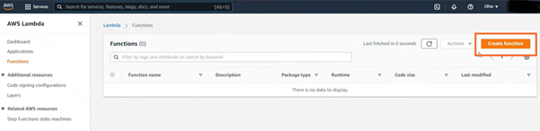
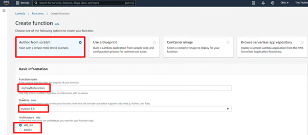
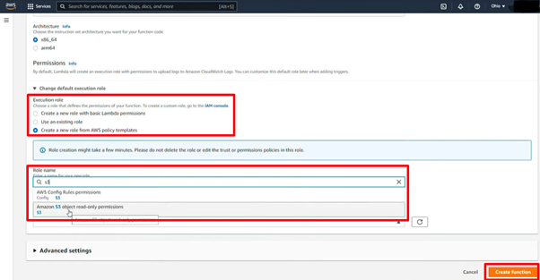
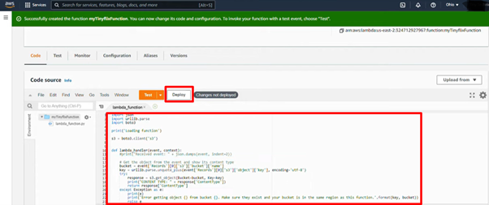
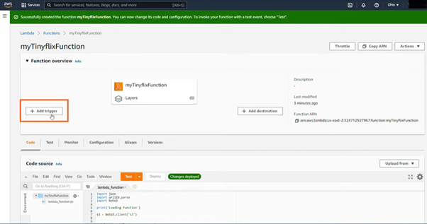
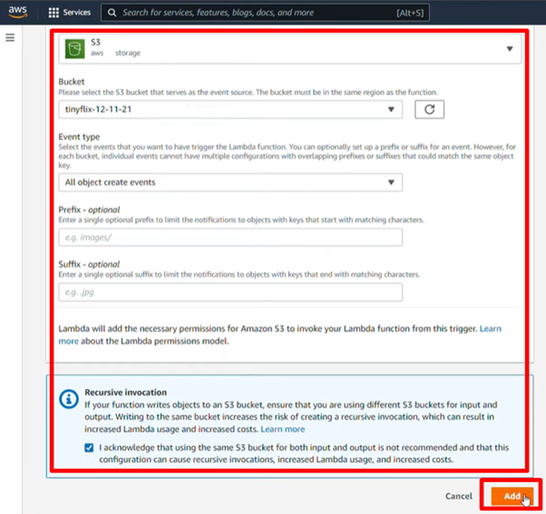

# AWS Lambda: Serverless Compute for Applications  

## **Purpose**  

AWS Lambda is a serverless compute service that automatically manages infrastructure, allowing developers to focus on application logic. It runs code in response to events and handles tasks like server provisioning, scaling, and patching. Lambda is ideal for building scalable, event-driven applications, requiring developers to supply only the code while AWS manages the underlying compute service.

## **How It Works**  

1. **Create Function**:  
   - Create a function (the primary unit of Lambda) from scratch or an existing template, defining details and permissions.
   
   
   
2. **Upload Code**:  
   - Write and upload the code in supported programming languages (e.g., Python, Node.js, Java, Go) along with dependencies. Lambda packages this into an execution environment. The code is stateless.
    

3. **Event-Driven Trigger**:  
   - Create a trigger to run the function using AWS services.
    
   - Configure the trigger settings.
   
4. **Scaling**:  
   - Lambda automatically scales horizontally by creating multiple instances of your function to handle concurrent requests.  

## **Features & Benefits**  

1. **Reduced Operational Overhead**:  
   - AWS manages the infrastructure, eliminating the need for server management and patching.  

2. **Autoscaling**:  
   - Supports applications with high throughput by automatically scaling to handle any level of request concurrency.  

3. **Service Integration**:  
   - Seamlessly integrates with AWS services like S3, DynamoDB, SNS, SQS, and API Gateway to process triggers such as file uploads, database updates, and HTTP requests.  

4. **Cost Efficiency**:  
   - Pay only for requests and the compute time (billed in 1-millisecond increments). No charge when the function is idle.  

## **Use Cases**  

1. **Real-Time File Processing at Scale**:  
   - Automatically resize images or convert file formats when a file is uploaded to S3.  

2. **Data Transformation**:  
   - Reprocess streams of data in real time from Amazon Kinesis or DynamoDB for ML applications.  

3. **Run Interactive Web and Mobile Backends**:  
   - Build lightweight APIs using API Gateway and Lambda to serve scalable online experiences.  

4. **Event-Driven Workflows**:  
   - Trigger workflows in response to changes in AWS services or third-party APIs.  

5. **IoT Applications**:  
   - Process data from IoT devices and execute business logic in response to events without over-provisioning resources.  

## **Pro Tips**  

- **Optimize Function Size**: Keep deployment packages small to reduce cold start times. Use Lambda layers to separate dependencies.  
- **Monitor and Optimize Costs**: Use CloudWatch to analyze execution times and identify opportunities for cost optimization.  
- **Enable Reserved Concurrency**: Reserve capacity to ensure critical functions always have compute resources.  
- **Test with Local Tools**: Use tools like the AWS SAM CLI for local testing and debugging before deployment.  

## **Common Issues**  

1. **Cold Starts**:  
   - Functions inactive for some time may experience delays when invoked. Reduce this by:  
     - Optimizing function code size.  
     - Leveraging Lambda Layers for dependencies.  
     - Enabling **Provisioned Concurrency** to keep functions warm.   

2. **Execution Limits**:  
   - AWS Lambda has limits on memory (128 MB–10 GB), execution duration (up to 15 minutes), and storage size. Ensure your application requirements align with these limits.  

3. **IAM Misconfigurations**:  
   - Functions may fail to access required resources without necessary permissions. Regularly audit IAM policies to avoid errors.  

## **Pricing**  

- **Compute Pricing**: Charged based on the number of requests and duration of code execution, billed in 1-millisecond increments.  
- **Free Tier**: 1 million requests and 400,000 GB-seconds of compute time per month are free.  
 

