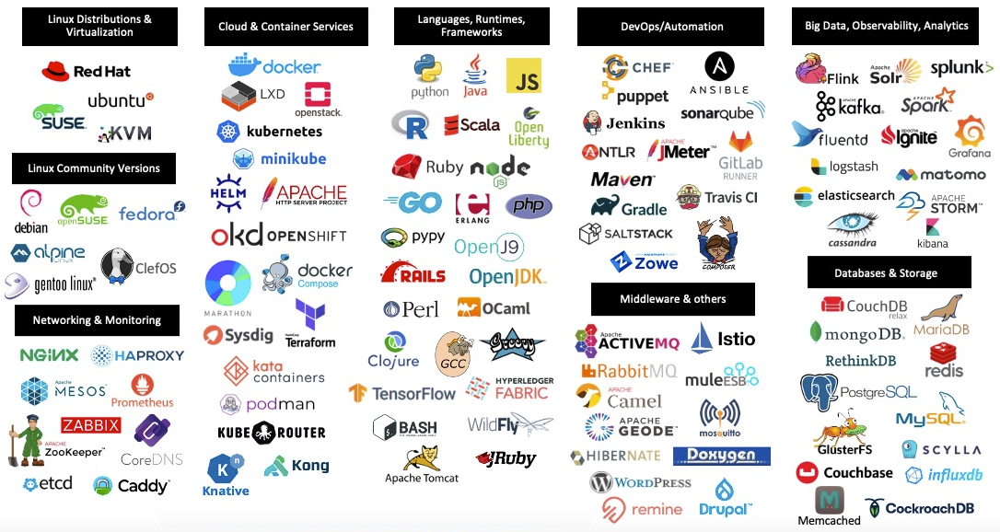

# **Open Source: Collaborative Software Development**

## **Purpose**

Open Source refers to programs and systems whose source code is publicly accessible on repositories, allowing anyone to view, copy, modify, and distribute it. Open source promotes collaboration, innovation, and transparency by enabling developers and organizations to build upon existing code.

## **How It Works**

1. **Published Source Code:**
   - Source code for programs and systems is publicly accessible on open source platforms like GitHub, GitLab, and Bitbucket.

2. **Collaborative Development:**
   - Contributors can inspect, copy, modify, and contribute to the source code by submitting pull requests to fix bugs, add new features, and improve performance.

3. **Version Control:**
   - Platforms like GitHub and GitLab use tools such as Git to manage changes and contributions, which are reviewed and approved by maintainers or committers.

4. **Licensing:**
   - Open source projects are governed by licenses that dictate usage, modification, and distribution terms. Common licenses include:  
     - **MIT License:** Minimal restrictions on reuse.  
     - **Apache License:** Includes a patent grant.  
     - **GPL License:** Requires derivative works to remain open source.

5. **Community Engagement:**
   - Contributors, committers, and organizations engage with open source projects to provide feedback, share knowledge, and drive innovation.

## **Features & Benefits**

1. **Transparency:**
   - Full visibility into software development creates trust and understanding.

2. **Cost-Effective:**
   - Eliminates licensing fees, reducing barriers and increasing accessibility.

3. **Customization:**
   - Code can be modified and adapted to meet specific organizational needs.

4. **Rapid Innovation:**
   - A global community accelerates development through collaboration.

## **Use Cases**

1. **Operating Systems:**
   - Linux, FreeBSD, and Ubuntu are widely used open source operating systems.

2. **Enterprise Solutions:**
   - Open source platforms like Kubernetes and Apache Kafka enable scalable and reliable enterprise infrastructure.

3. **Programming Languages:**
   - Python, R, and Apache Spark are widely used for data analysis and machine learning.

4. **Web Development:**
   - WordPress, Drupal, Django, and Node.js enable easy website creation and management.

5. **Education and Research:**
   - Open source software provides accessible tools for learning, teaching, and scientific research.

## **Pro Tips**

1. **Contribute to Projects:**
   - Contribute to open source projects to gain experience and build a reputation in the community.

2. **Stay Updated:**
   - Monitor changes and updates in open source projects to ensure compatibility and security.

3. **Use Reliable Sources:**
   - Download open source software only from trusted repositories to avoid security risks.

## **Common Issues**

1. **Limited Support:**
   - Some open source projects may lack dedicated, timely support.

2. **Security Risks:**
   - Open source software can have bugs or outdated making it vulnerable to security risks.

3. **Compatibility Issues:**
   - Modifying open source software may lead to integration challenges with other systems.

## **Pricing**  
- Open source software is free to use but may incur costs for customization, support, and maintenance.

