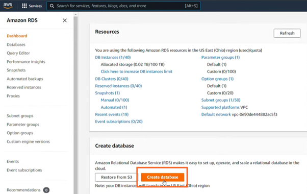
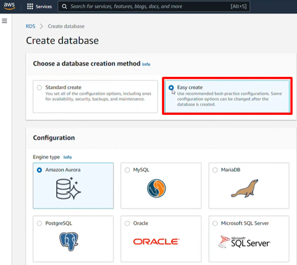
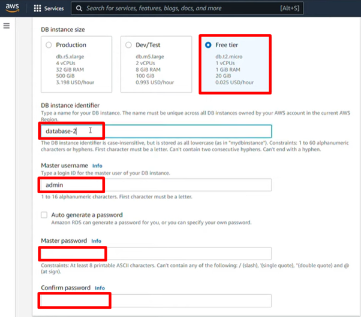
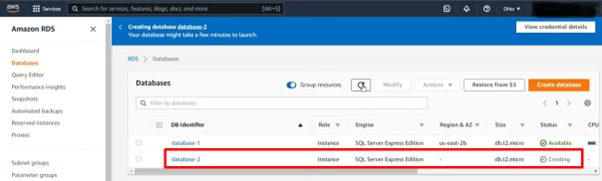

# RDS: Relational Database Management

## **Purpose**  

Amazon Relational Database Service (RDS) is a managed database service which simplifies the setup, operation, and scaling on demand of relational databases in the cloud. RDS allows developers to focus on application logic instead of underlaying database administrative tasks like provisioning, configuring, patching, backup, recovery, and scaling.

## **How It Works**  

 

**Setup and Configuration**:  
   - Create database using standard or easy setup option. 
      
     

   - Select a database engine. RDS supports multiple relational database engines:  
     - **Amazon Aurora**: High-performance engine compatible with MySQL and PostgreSQL.  
     - **MySQL**: Open-source relational database.  
     - **PostgreSQL**: Advanced open-source relational database.  
     - **MariaDB**: Community-developed relational database.  
     - **Oracle Database**: Enterprise-grade relational database.  
     - **Microsoft SQL Server**: Popular commercial database.   

- Specify the instance details, storage, and region.
   
   

## **Features & Benefits**  

- **Easy Management**: Automates time-consuming database administrative tasks. 
- **Mutiple Engine Options** Deploy and scale relational database engines tailored to workload requirements.  
- **High Availability**: Multi-AZ deployments provide database redundancy and failover capabilities.  
- **Operational Expertise** Leverages cloud-based security best practices and innovation proven over decades.
- **Scalability**: Supports dynamic scaling to handle unpredictable workloads.  

## **Use Cases**  

1. **Web and Mobile Applications**:  
   - Supports high availability, throughput, and storage scalability for growing or unpredictable applications.  

2. **E-commerce Platforms**:  
   - Manage customer data, product catalogs, and transactional data with seamless scaling.  

3. **Enterprise Applications**:  
   - Deploy traditional enterprise applications like CRM or ERP. 

4. **Upgrade Legacy Databases**: 
   - Migrate to engines like Amazon Aurora for high performance and availability of commercial databases at a fraction of the cost.

## **Pro Tips**  

- Use **Multi-AZ deployments** for high availability and automatic failover.  
- Monitor database health using **Amazon CloudWatch** and enable **Performance Insights** to analyze queries and optimize performance.   

## **Common Issues**  

1. **High Costs**:  
   - Long-running databases with unmonitored usage can result in high costs. Use AWS Budgets and tagging for tracking expenses.  

2. **Connection Errors**:  
   - Misconfigured VPCs or security groups can block database access. Ensure proper network configurations.  

## **Pricing**  

- Pricing depends on the database engine, instance type, storage capacity, and region.  
- Charges apply for:  
  - Instance uptime (per hour).  
  - Data transfer in and out of RDS.  
  - Backup storage and read replicas.  
- Free Tier includes 750 hours per month of RDS usage (db.t2.micro or db.t3.micro) for one year and 20GB of storage and backups.  
