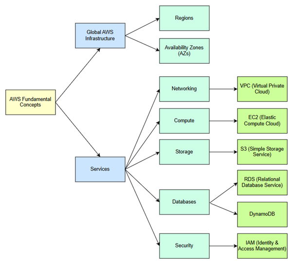

## **Progress and Activities** 
### **1. SSH Keys**  
- Creating SSH key for secure GitHub connection
 

  1. `ssh-keygen -t ed25519 -C ***@gmail.com`  This command generates the new SSH keys using the Ed25519 secure algorithm which is known for performance and small key size. A "-C" comment is added with the email to identify the purpose/owner of the key. By default the key is saved to the file path: ~/.ssh/id_ed25519 A passphrase can be set for added security. Click "enter" to use default location and no passphrase.

 

  2. `ls -al ~/.ssh`  This command lists all the files in the SSH directory.
  3. `cat ~/.ssh/id_ed25519.pub` This command displays the contents of the public key. Note this should be hidden.

   

- Save the SSH key in GitHub.
 
  

 4. `ssh -T git@github.com`  This command test the SSH connection to GitHub. An error message such as key not added, permissions incorrect will indicate if there is an error.

- Removing SSH keys

 
 
  1. `ls ~/.ssh ` This command in Gitbash lists the key contents in the SSH directory. 
  2. `cd ~/.ssh ` This command goes to the SSH directory so it is active to make a change.
  3. `Rm id"tab"` This command removes the file name (ID) of the private key and then the public key. Using the "tab" autofills the key from this location instead of writing it. This command is entered twice - for the private and public key.
  4. `RM -i * ` This command removes all the SSH keys in the SSH directory   

  ### **2. Understanding AWS Concepts**
Making notes for fundamental concepts:

[Amazon Bedrock](/Ninjas/MasterClass-04Amit/Day%204/Amazon%20Bedrock/README.md)

[Cloudfront](/Ninjas/MasterClass-04Amit/Day%204/Cloudfront/README.md)

[Cloudwatch](/Ninjas/MasterClass-04Amit/Day%204/CloudWatch/README.md)

[DynamoDB](/Ninjas/MasterClass-04Amit/Day%204/DynamoDB/README.md)

[EC2](/Ninjas/MasterClass-04Amit/Day%204/EC2/README.md)

[ELB](/Ninjas/MasterClass-04Amit/Day%204/ELB/README.md)

[IAM](/Ninjas/MasterClass-04Amit/Day%204/IAM/README.md)

[Lambda](/Ninjas/MasterClass-04Amit/Day%204/Lambda/README.md)

[Open Source](/Ninjas/MasterClass-04Amit/Day%204/Opensource/README.md)

[RDS](/Ninjas/MasterClass-04Amit/Day%204/RDS/README.md)

[Route 53](/Ninjas/MasterClass-04Amit/Day%204/Route53/README.md)

[S3](/Ninjas/MasterClass-04Amit/Day%204/S3/README.md)

[Security Group](/Ninjas/MasterClass-04Amit/Day%204/Security%20Group/README.md)

[SES](/Ninjas/MasterClass-04Amit/Day%204/SES/README.md)

[SNS](/Ninjas/MasterClass-04Amit/Day%204/SNS/README.md)

[VPC](/Ninjas/MasterClass-04Amit/Day%204/VPC/README.md)