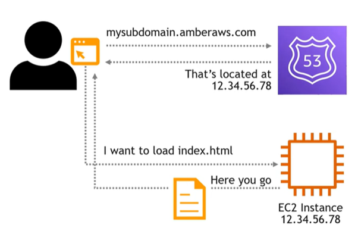
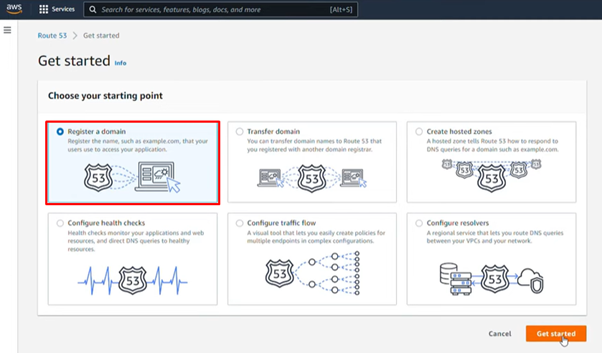
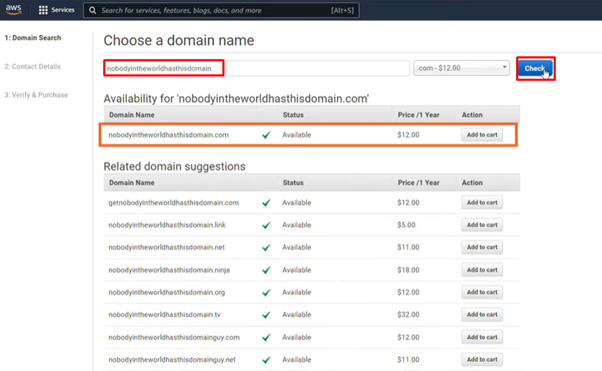
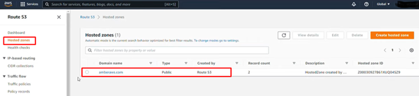
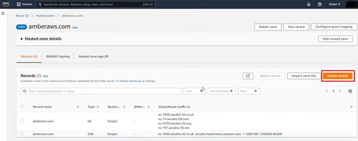
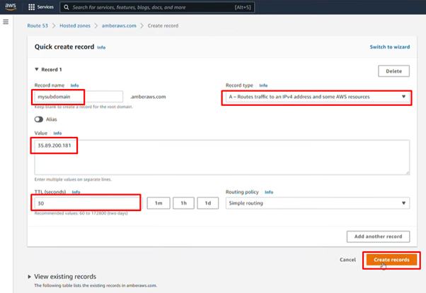
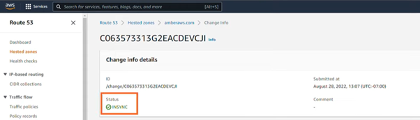

# **Amazon Route 53: Scalable DNS Management**

## **Purpose**

Amazon Route 53 is a Domain Name System (DNS) web service which connects DNS requests to the IP address of the AWS or external resource. It also provides domain registration, routing traffic for applications, and health checking to improve reliability.  

## **How It Works**

1. **Domain Registration:**
   - Register new domain names directly through Route 53 or transfer existing ones.  
   
   

2. **Create Hosted Zones:**
   - Set up hosted zones (which is given automatically when a domain is registered) to manage DNS records for a domain.  
     - **Public Hosted Zone:** For domains accessible via the internet.  
     - **Private Hosted Zone:** For domains accessible only within a VPC.  
   

3. **Configure DNS Records:**
   - Add DNS records like A, AAAA, CNAME to define how traffic is routed for the domain.  
   
      
         

## **Features & Benefits**

1. **High Availability:**
   - Operates from AWS globally distributed DNS servers for high availability and low latency.

2. **Health Monitoring:**
   - Automatically checks endpoint health and reroutes traffic to minimize downtime.

3. **Domain Registration:**
   - Simplifies domain management with integrated registration and DNS.

4. **AWS Integration:**
   - Integrates with AWS services like S3, CloudFront, and Elastic Load Balancer to direct traffic efficiently.

## **Use Cases**

1. **Website Hosting:**
   - Route traffic to web servers hosted on AWS or external environments.

2. **Multi-Region Failover:**
   - Redirect traffic to secondary regions for failover during outages to ensure high availability.

3. **Content Delivery Optimization:**
   - Pair with AWS CloudFront for delivering content with low latency.

## **Pro Tips**

1. **Implement Routing Policies:**
   - Use policies like geo-location and latency-based routing to enhance user experiences.

2. **Use DNS TTL Values Wisely:**
   - Optimize time-to-live (TTL) settings to cache DNS records.

## **Common Issues**

1. **Configuration Errors:**
   - Misconfigured records or routing policies can lead to traffic misdirection.

2. **Propagation Delays:**
   - DNS updates may take time to propagate depending on TTL values.

## **Pricing**

1. **Domain Registration:**
   - Domain registration fees vary by TLD and renewal options.

2. **Hosted Zone Management:**
   - Charged per hosted zone per month.

3. **DNS Queries:**
   - Charged based on the number of queries handled by Route 53.

4. **Health Checks:**
   - Additional charges apply for health checks and monitoring endpoints.

