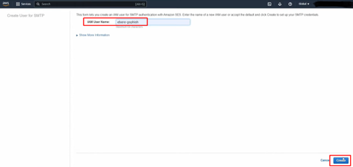

## **AWS Simple Email Service (SES)**

### **Purpose**

AWS Simple Email Service (SES) is cloud-based email service that enables businesses to send transactional emails, marketing emails, newsletters and notifications reliably at scale. It provides high deliverablity and easy integration into existing applications.

### **How It Works**

1. **Verify & Authenticate Sending Identity:**
 - Verify ownership of the domain or email addresses to ensure email delivery.

  - For transactional emails, domain verification is recommended. 
     - Add the CNAME records provided by SES to the DNS provider. DNS propagation and verification can take up to 72 hours.
    - SES supports DKIM and SPF for email authentication. 

2. **SMTP Settings:**
- Create SMTP user with credentials to send emails.

3. **Send Test Email:**
- As a verified identity create and send a custom test email.

4. **Configure custom SMTP settings in App:**
- Integrate SMTP settings into an application (e.g., WordPress) by entering the SES SMTP endpoint, username, password, and port (use port 587 for TLS encryption).

 

5. **Request Production Access:**
- SES operates in a default sandbox environment, limiting emails to verified addresses to prevent fraud and malicious activity. To send emails to unverified recipients, request production access.
 

6. **Monitor Email Metrics:**
 - Use Amazon CloudWatch to track email delivery performance, such as bounce rates and complaints.

   

### **Features & Benefits**

1. **Scalability:**
   - Automatically scales to handle high email volumes without manual intervention.

2. **High Deliverability:**
   - Minimize emails being marked spam, as Amazon is recognized as a trusted sender.

3. **Enhanced Security:**
   - Supports email authentication protocols like DKIM, SPF, and DMARC to protect against phishing and spoofing.

4. **Simplified Email Management:**
   - Automates sending bulk emails and provides tools for secure incoming email handling.

### **Use Cases**

1. **Transactional Emails:**
   - Send order confirmations, password resets, and system alerts triggered by user actions.

2. **Global Marketing Emails:**
   - Deliver newsletters and promotional emails to millions of users worldwide.

3. **Event Notifications:**
   - Notify users about critical events, updates, or system changes in real time.

### **Pro Tips**

1. **Verified Domains:**
   - Verify domains or email addresses to ensure deliverability.

2. **Email Monitoring:**
   - Monitor metrics like bounce rates and complaints. Set alerts for unusual activity to maintain sender reputation.

### **Common Issues**

1. **Spam:**
   - Misconfigured emails may end up in spam folders so use authentication protocols like DKIM and SPF.

2. **Domain Verification Delays:**
   - DNS propagation for domain verification can take up to 72 hours. Plan to avoid delays.

3. **IP Reputation:**
   - Large email volumes without any warm up can lead to poor deliverability. To build strong IP reputation start with small email volumes and gradually scale up.

### **Pricing**

1. **Outgoing Emails:**
   - Charged at $0.10 per 1,000 emails sent, plus additional charges for data transfer.

2. **Incoming Emails:**
   - Free for the first 1,000 emails received each month, then charged per email received.

