## **AWS Simple Notification Service (SNS)**

### **Purpose**

AWS Simple Notification Service (SNS) is a fully managed message publishing service (PubSub) that allows publishers to send messages to a topic. The topic fans out messages to millions of subscribers, which can be endpoints or devices such as email addresses, HTTP endpoints, SQS queues, or SMS messages.

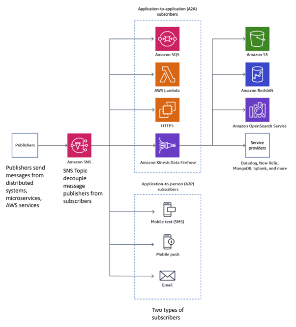

### **How It Works**

1. **Create Topic:**
   - Applications or services send messages to an SNS topic, which acts as the message hub.
   - Topics are the primary resource in SNS for publishing and managing messages.
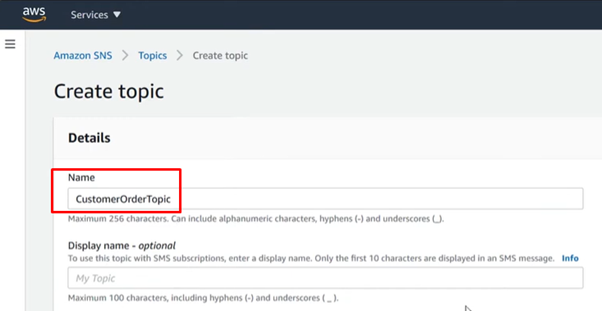
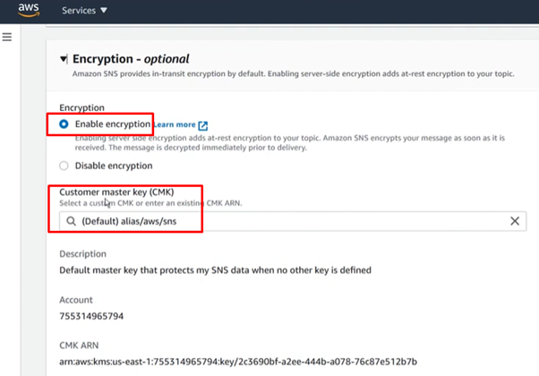
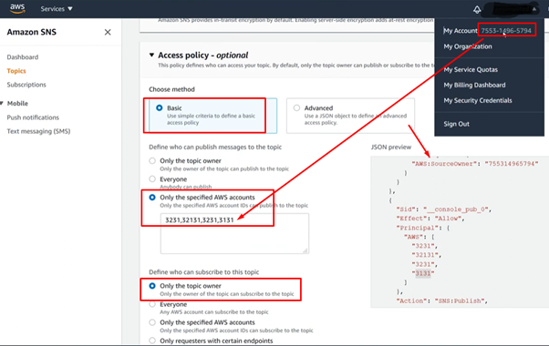
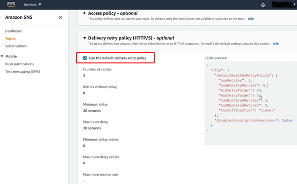
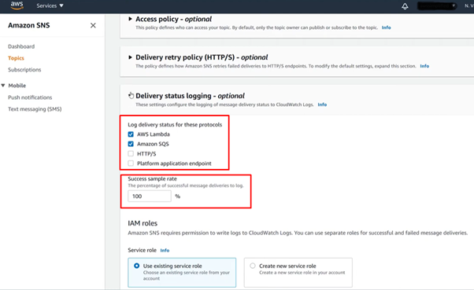

2. **Create Subscription:**
   - Devices, services, or applications (e.g., Lambda, SQS, HTTP, email, or SMS) subscribe to the SNS topic.  
   - A single topic can have multiple subscriptions. 
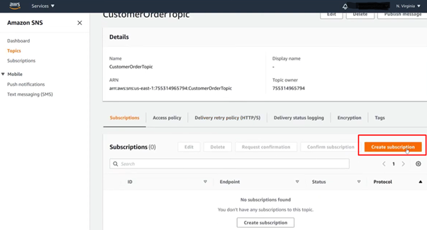
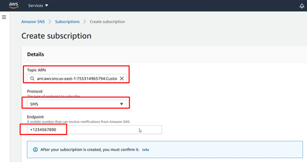
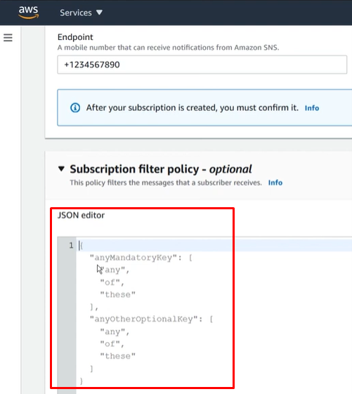
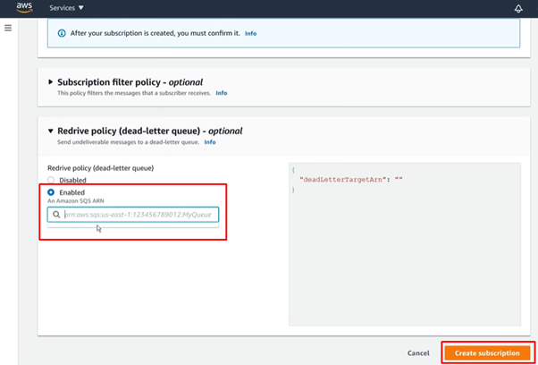

3. **Publish Messages:**
   - SNS delivers messages to all subscribed endpoints in real-time using a "fan-out" model.  
   - The service ensures delivery through retry policies and logging.  
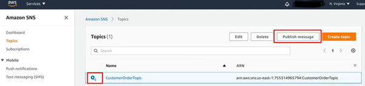
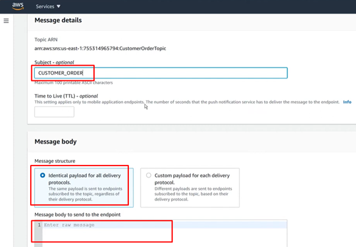
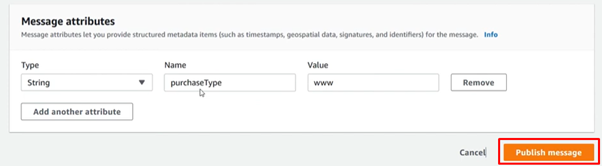

### **Features & Benefits**

1. **Scalability:**
   - Distribute messages to millions of endpoints simultaneously within milliseconds.

2. **Message Durability:**
   - Retry policies and integration with dead-letter queues (DLQs) help ensure message delivery.

3. **Application-to-Application (A2A) Notifications:**
   - Deliver messages to services like SQS, Lambda, or HTTP endpoints for seamless application communication.

4. **Application-to-Person (A2P) Notifications:**
   - Send notifications via SMS, email, or mobile push to subscribers directly.

5. **Filtering Messages:**
   - Use subscription filter policies to control which messages are delivered to which subscribers.

### **Use Cases**

1. **Worldwide Broadcast Messaging:**
   - Notify multiple endpoints simultaneously using push notifications, SMS, email, or HTTP/HTTPS.

2. **Event-Driven Applications:**
   - Trigger Lambda functions or send messages to SQS queues in response to events.

3. **Incident Management:**
   - Send alerts to on-call teams when alarms are triggered in CloudWatch or other monitoring tools.

### **Pro Tips**

1. **Dead Letter Queues (DLQs):**
   - Capture undelivered messages for troubleshooting.

2. **Message Filtering:**
   - Define filter policies to ensure subscribers only receive relevant messages.

3. **Delivery Status Logging:**
   - Enable CloudWatch Logs for tracking delivery successes and failures.

4. **Message Encryption:**
   - Use AWS Key Management Service (KMS) for encrypting messages at rest.

### **Common Issues**

1. **Message Loss:**
   - Without DLQs, undelivered messages may be lost.

2. **Overhead Costs:**
   - Logging and excessive retries for unsuccessful deliveries can increase costs.

### **Pricing**

1. **Pay-As-You-Go:**
   - Charged per message published, delivered, and data transferred.

2. **Free Tier:**
   - Includes 1 million publishes, 1 million HTTP/HTTPS notifications, and 1,000 email notifications.
