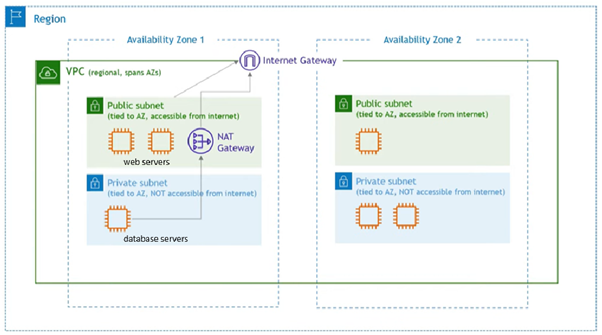
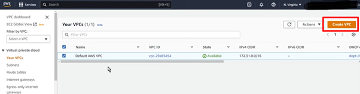
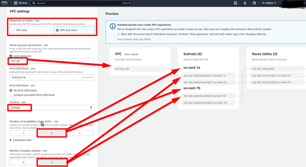
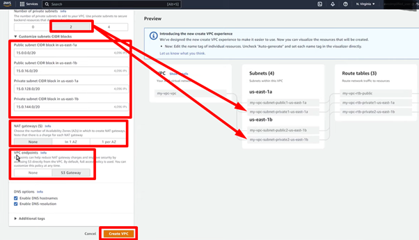
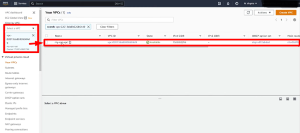
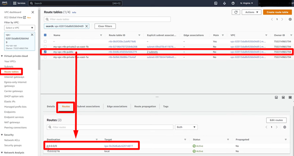
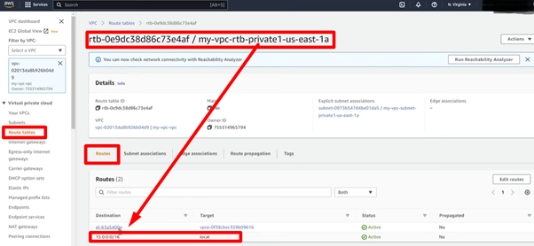
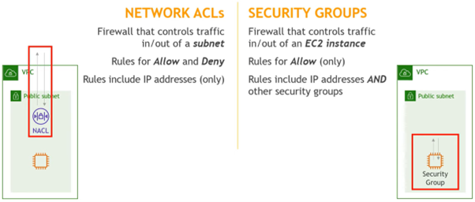

# **AWS VPC: Virtual Private Cloud**

## **Purpose**
AWS Virtual Private Cloud (VPC) logically isolates computing resources in a private virtual network hosted on the provider's public cloud infrastructure. Setting the IP addressing for the VPC, and subnets within, route tables, internet gateways controls communication between the resources within the network and to the internet.

## **How It Works**
  
Note: AWS provides a default VPC when an account is created.

### **1. Create a VPC**

- **VPC configuration:**  
  - Selecting "VPC and more" allows you to configure more settings in one console.
  - Name the VPC and create a IPV4 CIDR range (this cannot be changed later). Example: `15.0.0.0/16` allows up to 65,536 IP addresses 5 of which are reserved for AWS.  
  - Define tenancy - default is using what AWS assigns in the region specified.
  - Define number of AZ for redundancy.

### **2. Subnets**
- **Create Subnets:**  
  - Divide the VPC CIDR into smaller subnets for network control and organization.  
    - **Public Subnet:** Example CIDR: `15.0.0.0/20`  
      - Define number of public subnets which enables resources public internet access via an Internet Gateway.  
    - **Private Subnet:** Example CIDR: `15.0.128.0/20`  
      - Define number of private subnets which isolates internal resources which can access internet securely for updates, patches via a NAT with a public IP.

### **3. Route Tables**
- **Public Route Table:**  
  - Add a route to the Internet Gateway for outgoing internet traffic (`0.0.0.0/0`).  
  

- **Private Route Table:**  
  - Use a NAT Gateway or NAT Instance to enable secure internet access for private subnets.
  

- **Associate Subnets:**  
  - Attach specific route tables to subnets for precise traffic control.

### **4. Gateways**
- **Internet Gateway (IGW):**  
  - Attach to the VPC to allow resources in public subnets to access the internet.

- **NAT Gateway/Instance:**  
  - Enable private subnets to initiate outbound traffic to the internet securely.

- **Virtual Private Gateway (VGW):**  
  - Connect the VPC to an on-premises network via VPN or AWS Direct Connect.

### **5. Security Groups & Network ACLs**

- **Security Groups:**  
  - Stateful firewalls attached to instances.  
  - Example Rules:  
    - Allow inbound SSH (port 22) from specific IPs.  
    - Allow HTTP/HTTPS (ports 80/443) for web traffic.  

- **Network ACLs (NACLs):**  
  - Stateless filters for subnet traffic.  
  - Example: Deny traffic from a malicious IP range.

## **Features & Benefits**

1. **Isolated Virtual Private Network:**  
   - Build secure environments for workloads which are logically isolated from other networks hosted on the cloud provider's infrastructure.

2. **Customizable Networking:**  
   - Control routing, IP allocation, and traffic filtering.

3. **Scalability:**  
   - Dynamically add or modify subnets, gateways, and route tables as the network demands.

## **Use Cases**

1. **Web Applications:**  
   - Host public-facing applications with webservers in public subnets, with databases in private subnets for security.

2. **Hybrid Deployments:**  
   - Migrate and connect resources from on-premises networks to the cloud securely.

3. **Big Data & Analytics:**  
   - Process data securely within isolated subnets, scaling resources as needed.

4. **Disaster Recovery:**  
   - Use VPC for site replication to ensure business continuity.

## **Pro Tips**

- **Plan CIDR Blocks:**  
  - Avoid overlapping with on-premises or other VPCs to simplify routing.

- **Enable Flow Logs:**  
  - Monitor and troubleshoot network traffic within the VPC.

- **Use AWS Transit Gateway:**  
  - Simplify routing across multiple VPCs and on-premises networks.

## **Common Issues**

1. **Overlapping CIDR Blocks:**  
   - Leads to routing conflicts in hybrid or multi-VPC environments.

2. **Internet Access in Private Subnets:**  
   - Requires proper configuration of NAT Gateway/Instance otherwise resources are exposed to the internet.

## **Pricing**

1. **VPC Usage:**  
   - Free for default components (VPC, route tables, etc.).

2. **Data Transfer:**  
   - Charges apply for data transferred out of AWS.

3. **NAT Gateway:**  
   - Billed hourly and by data processed.

