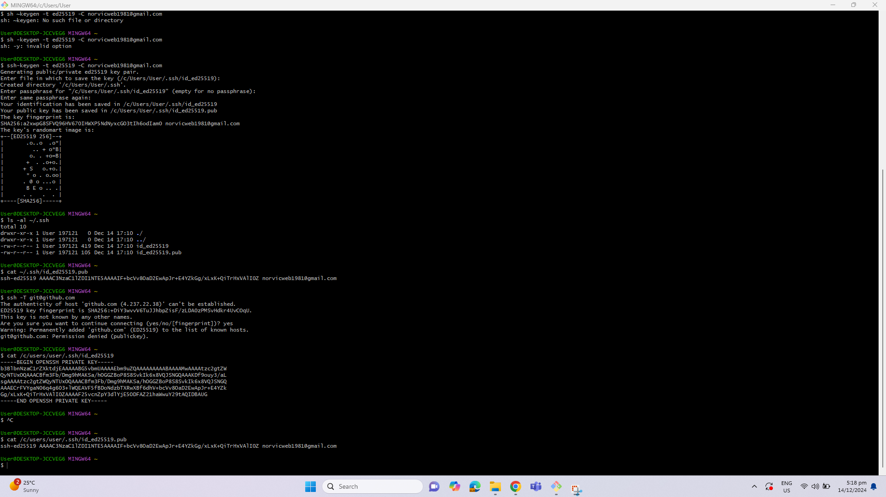
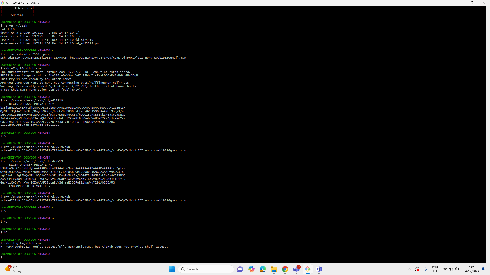

# Day 01 notes

- Install Git - Install VS Code - Setup branch in Git - Create Hash in Git

## Activity

- Create a repository in Github
- Create a new branch in Git
- Create Hash key
- Upload Hash 
- link repo in Git
- configuration of Gitbash

## Codes

### For Git

- Generate Key: 
    > ssh-keygen -t ed25519 -C "your_email@example.com 

- Check keys:
    > ls -al ~/.ssh

- Copy Key: 
    > cat ~/.ssh/id_ed25519.pub

- Authenticate the Connectivity:
    > ssh -T git@github.com

-   Clone Repository
    > git clone https://github.com/anuvindhs/TechWithAnuvindh.git

## Notes

### Coding with Git

### Git Guide
